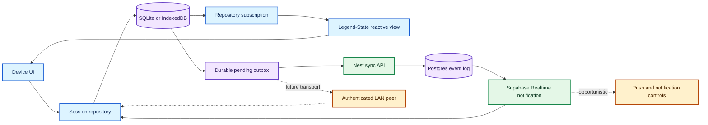
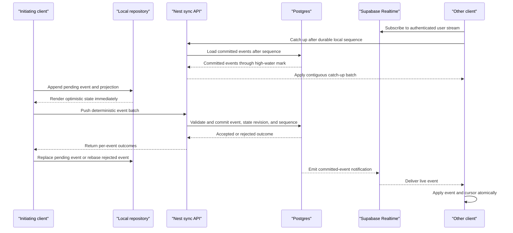

# Focus Timer Product and Sync Architecture

**Status:** Decision-complete product and architecture record for the first technical PRD

**Last updated:** 2026-08-29

**Purpose:** Preserve the product direction, lock the foundational platform and synchronization decisions, and define the gates required before implementing the first technical PRD.

## 1. Executive summary

This product is a personal-first, AI-native focus timer inspired by [Flow](https://www.flow.app/). Its core purpose is not merely to measure time. It should help someone choose a small, concrete direction, stay focused on it, and finish the day with credible evidence that they made progress on work that matters to them.

The first multiplayer capability is **one person controlling the same focus session from multiple devices**. A session started on a Mac should be visible and controllable from an Android phone, web client, or another authorized device. Local controls must remain immediate, actions must survive losing internet, and devices should eventually converge without duplicating or losing transitions.

The foundational technical requirement is therefore not specifically “use PowerSync” or “use WebSockets.” It is:

> Implement durable synchronization semantics at level one.

A WebSocket provides a low-latency transport but not offline synchronization by itself. The first release therefore uses a narrow custom synchronization protocol: SQLite on native clients, IndexedDB on web, a durable local outbox, HTTP upload and catch-up through Nest on Vercel, and Supabase Realtime as an opportunistic live-notification path. Postgres remains canonical. Legend-State v3 provides fine-grained reactive client state above the repository and may persist lightweight UI state through its Expo SQLite key-value plugin on native and IndexedDB plugin on web. It does not own canonical timer events, the outbox, projections, or the sync cursor. PowerSync is not part of v1; preserve the repository boundary so managed replication can be reconsidered if the domain expands or maintaining custom sync becomes disproportionate.

The first release permits several sessions to run simultaneously. Conflicts are scoped to a single session, and reports show both full per-session duration and deduplicated wall-clock focus time so overlaps remain understandable.

## 2. Product vision

### 2.1 Product promise

Help a person answer:

- What did I decide to work on?
- What did I actually do?
- How long did it take?
- Which tools or contexts were involved?
- When am I most productive?
- What did I ship, and what impact did it have?
- Did I make meaningful progress on what matters to me?

The desired emotional outcome is that the user ends the day feeling grounded in real progress rather than merely seeing a collection of activity metrics.

### 2.2 Origin of the idea

The product is informed by a successful personal workflow: tracking freelance work methodically in roughly 15-minute increments. Detailed time records served two purposes:

1. They gave the client an understandable account of the work performed.
2. They created a personal commitment mechanism that reduced distractions and kept the current task salient.

The product should preserve both benefits while adding modern assistance, cross-device continuity, privacy, and AI-generated reflection.

### 2.3 Positioning

The product should feel like:

- A successor to a focused Pomodoro application, not an enterprise surveillance suite.
- A personal progress system first, with team and organization capabilities later.
- A self-reporting tool augmented by on-device context, not spyware.
- A calm source of small, solid direction rather than another overwhelming project-management system.

## 3. Product principles

### 3.1 Local actions are immediate

Starting, pausing, resuming, or completing a session must update the device immediately. A network request must never sit in the critical path of the local control response.

### 3.2 Time is derived, not continuously synchronized

Devices synchronize state transitions and their timestamps, not a ticking counter every second. Each device derives the displayed elapsed time from the latest accepted transition.

### 3.3 Offline is normal

The user must be able to operate the timer without internet. Actions should survive application termination and synchronize later.

### 3.4 One user, many devices is the first multiplayer mode

Shared team sessions are not required for the first synchronization milestone. The first goal is for all authorized devices belonging to one user to converge on the same session history. A user may have several simultaneously running sessions; state revisions and transition conflicts are scoped per session rather than globally per user.

### 3.5 Self-reporting, not surveillance

Manual descriptions and explicit integrations are first-class inputs. Sensitive activity observation should default to local-only storage. Only user-approved summaries or evidence should leave the device.

### 3.6 The history must be explainable

The system should retain enough durable history to explain why the current timer state exists and to support later reports, exports, corrections, and AI analysis.

## 4. Product scope

### 4.1 Initial product scope

- Create a focus session with a concise intention.
- Use an elapsed stopwatch in v1; configurable countdowns and fixed Pomodoro cycles are deferred.
- Start, pause, resume, and complete the session.
- Run multiple sessions simultaneously when work legitimately overlaps.
- Show the same session on multiple devices owned by one user.
- Allow any authorized device to issue a control action.
- Continue operating without internet.
- Recover and converge after reconnecting.
- Participate as a full offline peer from native and web clients.
- Preserve a detailed session history.
- Support manual notes and context.
- Export useful records, eventually including CSV.
- Establish a privacy boundary for sensitive on-device observations.
- Require a Supabase-authenticated account before creating a session.

### 4.2 Near-term product scope

- Projects, goals, tags, and tools used.
- Day and week review.
- AI-assisted session descriptions and summaries.
- Integrations with selected work tools.
- Productivity patterns based on user-approved data.
- macOS global shortcuts and system-level focus controls.

### 4.3 Later product scope

- Multi-tenant teams and organizations.
- Shared projects and possibly shared focus sessions.
- Weekly and monthly impact narratives.
- Promotion or performance-review evidence.
- Connections between time spent, work shipped, and measurable impact.
- Team-aware AI assistance without turning the product into employee monitoring.

### 4.4 Explicit non-goals for the first synchronization milestone

- Synchronizing the displayed timer every second.
- Collaborative document editing.
- Shared sessions involving several different users.
- General-purpose project management.
- Uploading raw application-observation history by default.
- Perfect peer-to-peer replication of every future collection.
- Shipping same-LAN cross-device control in v1; devices operate independently offline and reconcile through the cloud later.

## 5. Platform requirements

### 5.1 Mobile

The repository currently uses Expo and React Native for mobile. Android is a first-class target. Native storage, notification controls, and later device discovery require an Expo development build rather than relying indefinitely on Expo Go. Active sessions expose persistent Android notification controls. Remote changes may use push opportunistically, but correctness never depends on background execution or push delivery; the application always catches up when foregrounded.

### 5.2 Web

The repository currently uses Next.js for the web client. Web is a full offline peer, using IndexedDB for its canonical event log, pending overlay, outbox, projections, and cursor. It implements the same repository contract and conformance tests as native SQLite without depending on Expo SQLite's web implementation.

### 5.3 macOS

The Mac experience should eventually support:

- Global keyboard shortcuts.
- Application and website blocking.
- Activity observation with explicit permission and clear controls.
- System-level focus controls.
- Menu-bar or similarly lightweight access.
- Local-network coordination with the phone.

These capabilities require a native desktop shell and native macOS integrations. A time-boxed Tauri capability spike must prove menu-bar lifecycle, global shortcuts, foreground-application observation, permissions and signing, one custom native API bridge, and a supported app/site-blocking mechanism. Tauri is selected only if those capabilities work without duplicating the application lifecycle or making native bridging the dominant complexity. Otherwise the Mac application uses SwiftUI and shares only protocol, generated types, and backend contracts. “Expo desktop” is not the macOS architecture.

Tauri does not fundamentally remove access to public macOS APIs allowed by the application's signing, entitlements, sandbox, and user permissions. It packages a native Rust process with a WKWebView; unavailable capabilities can be reached through Rust bindings or linked Objective-C/Swift shims. The tradeoff is ergonomic: Tauri's documented desktop plugin path is Rust, while its first-class Swift plugin bridge targets iOS. AppKit lifecycle work, app extensions, accessibility flows, and signing-sensitive integrations may therefore require custom bridge and Xcode work.

Tauri offers React/TypeScript UI reuse, a small system-webview shell, Rust for local services, scoped command permissions, and existing desktop plugins. SwiftUI offers direct AppKit and Swift-concurrency integration, native controls, and the simplest path for Apple-specific extensions, but shares little UI code with Next.js or Expo. The capability spike decides from working evidence rather than assuming either tradeoff is dominant.

### 5.4 Native feel

“Cross-platform” must not mean identical platform behavior. Shared contracts, synchronization semantics, and design language should coexist with platform-specific controls, navigation, permissions, background behavior, and system integrations.

## 6. Current repository boundary

As observed on 2026-08-29, the working tree contains:

- `apps/web`: Next.js App Router application.
- `apps/mobile`: Expo Router application.
- `apps/api`: NestJS API with oRPC integration.
- `packages/api-contract`: shared runtime-validated API contract.
- `packages/api-client`: shared typed client.
- `packages/database`: an in-progress Drizzle/Postgres package with no application tables yet.

Only the health procedure and a validated `realtime.ping` WebSocket transport probe currently exist. The probe does not carry timer state or replace the selected HTTP and Supabase Realtime synchronization path. No timer, session, synchronization, SQLite repository, Legend-State integration, PowerSync, or TanStack DB implementation exists yet.

This document describes proposed architecture, not completed functionality. It intentionally does not modify the in-progress API/database work already in the working tree.

## 7. Core architectural distinction

Five related capabilities must not be collapsed into one concept:

1. **Durable local storage** — accepted and pending timer events survive process termination in SQLite or IndexedDB.
2. **Reactive client state** — Legend-State exposes repository projections and ephemeral UI state with fine-grained subscriptions.
3. **Server-mediated synchronization** — devices eventually converge through a durable backend.
4. **Local peer transport** — nearby devices can exchange events without internet.
5. **Background presentation** — notifications and operating-system controls may expose state but are not a durable synchronization channel.

Legend-State, TanStack DB, PowerSync, WebSockets, and SQLite address different portions of this system.



## 8. Selected custom synchronization path

### 8.1 SQLite/IndexedDB plus HTTP and Supabase Realtime

Supabase Realtime is well suited to quickly broadcasting a committed transition such as `session_paused` from Postgres to another connected device.

A WebSocket does not itself provide:

- Durable local storage.
- A persistent queue of offline mutations.
- Deduplication.
- Acknowledgement and retry semantics.
- Ordering across disconnects.
- Catch-up after a device misses events.
- Conflict handling.
- Reactive local database queries.
- Correct behavior when a mobile operating system suspends the connection.

Once SQLite or IndexedDB, an outbox, cursors, retries, deduplication, and catch-up are added, the application has a small custom sync engine. That is the selected v1 architecture because the domain is a narrow append-only timer protocol with low mutation volume and per-session conflicts.

Supabase Realtime is a latency accelerator, not a correctness boundary. Upload and explicit catch-up use HTTP, and every client must recover from its durable cursor when the Realtime connection disconnects, the application is suspended, or live delivery contains a sequence gap.

### 8.2 PowerSync as a future alternative

PowerSync is a local-database synchronization system rather than merely a live transport. Its clients read from local SQLite, queue local mutations, upload through the application backend, receive database changes, and expose watched queries. Its synchronization protocol handles initial download, reconnect catch-up, incremental changes, and consistent checkpoints.

PowerSync still leaves important responsibilities to this product:

- Applying uploaded operations in the application backend.
- Making backend writes idempotent.
- Defining authorization and which records each user receives.
- Defining domain-specific timer conflict behavior.
- Providing direct LAN or peer-to-peer synchronization.

### 8.3 Latency comparison

A custom online delivery path can be shorter:

```text
Mac -> application server -> phone
```

A PowerSync durability path is conceptually longer:

```text
Mac SQLite -> PowerSync upload queue -> application API -> Postgres
           -> PowerSync replication -> phone SQLite
```

The initiating device remains instant in either local-first design. A direct WebSocket may deliver a transition to the second online device sooner. This should be measured on physical devices instead of assumed.

### 8.4 Decision and replacement boundary

Select the custom SQLite/IndexedDB and HTTP path with Supabase Realtime notifications for v1. Implement it behind the shared `SessionRepository` contract so product components do not depend on its outbox, transport, cursor, or storage details.

The custom path must pass its correctness and recovery checks before multi-device synchronization ships. Latency is measured against initial goals and optimized from representative evidence rather than blocking implementation before a baseline exists. Reconsider PowerSync when the product gains many mutable relational collections, complex synchronized subsets or authorization rules, or when owning generic replication machinery consumes disproportionate engineering effort.

Even if the transport is replaced later, domain behavior remains application-owned: versioned timer events, per-session state revisions, accepted/rejected outcomes, corrections, reporting, and future LAN transport.

## 9. Legend-State, TanStack DB, and SQLite

### 9.1 What raw SQLite provides

SQLite provides durable local relational storage for Expo and the eventual Mac client. With a small repository layer and change notification mechanism, it can implement the native canonical event log, pending overlay, projection, and outbox.

Raw SQLite does not synchronize devices. It is only the native persistence component. The Next.js client uses IndexedDB behind the same behavioral repository contract.

### 9.2 What Legend-State provides

Legend-State v3 is the selected reactive client-state layer. Repository subscriptions update Legend observables, and React surfaces consume narrow observable values so timer, sync-status, selection, draft, and filter changes do not force unrelated renders. Domain commands still call `SessionRepository`; components must not mutate a Legend projection as though it were canonical timer state.

Legend's Expo SQLite persistence plugin uses `expo-sqlite/kv-store`, a SQLite-backed key-value API. It may persist lightweight state such as preferences, drafts, filters, and onboarding progress. The corresponding web path uses Legend's IndexedDB persistence plugin. Neither plugin replaces the relational SQLite or IndexedDB repository tables, their migrations, or the atomic event/outbox/projection/cursor transactions.

Expo SDK 57 compatibility is an accepted integration direction. Because the current Legend-State v3 beta package metadata declares an older optional `expo-sqlite` peer range, the first physical-device slice must still prove installation, cold-start rehydration, writes, reloads, and process-death recovery on the repository's pinned Expo 57 version before the integration expands.

### 9.3 What TanStack DB provides

TanStack DB provides reactive collections, live queries, optimistic mutations, and derived queries across collections. It can make application data pleasant and consistent to consume across React surfaces.

It is not itself the device-to-device synchronization system. It relies on a collection implementation or adapter such as PowerSync, Electric, RxDB, TrailBase, or a custom collection.

### 9.4 When TanStack DB becomes valuable

TanStack DB is most compelling when:

- Several collections participate in the same reactive view.
- The UI needs joins and derived aggregates that update incrementally.
- Optimistic mutation behavior should be standardized.
- Web, mobile, and desktop should share a consistent collection abstraction.
- The underlying sync implementation may need to be hidden behind a stable application interface.

For simple active-session queries and a short event log, direct repository queries may be simpler. The repository boundary should nevertheless be designed so a TanStack DB collection can be introduced without rewriting product components.

### 9.5 Maturity consideration

As of this record, TanStack DB is documented as beta and its PowerSync collection integration is documented by PowerSync as alpha. If evaluated, it should first be proven in a contained physical-device spike rather than silently becoming a critical dependency.

## 10. Other synchronization candidates

### 10.1 Electric

Electric is currently oriented around synchronizing the read path. Application writes still go through the application backend. It is valuable for live local data, but it does not remove the need to design this product’s offline write path.

### 10.2 RxDB

RxDB offers local-first collections and direct WebRTC replication. It is the named option that most directly addresses peer-to-peer synchronization. Its tradeoffs include adopting its broader document-database model, peer discovery/signaling, conflict behavior, and platform-specific WebRTC support or polyfills for desktop environments.

For a narrow append-only timer protocol, a custom authenticated LAN WebSocket may be easier to reason about. RxDB should be reconsidered if peer-to-peer collection replication becomes a broad product requirement rather than a timer-specific transport.

### 10.3 TrailBase

TrailBase provides a SQLite-based application backend and realtime record subscriptions. It has not yet been established as the embedded, cross-platform offline replication layer required here. It remains an alternative backend platform rather than the current leading client sync choice.

### 10.4 Decision table

| Option                                     | Best at                                                              | Missing or costly for this product                                                          | Current disposition                                                    |
| ------------------------------------------ | -------------------------------------------------------------------- | ------------------------------------------------------------------------------------------- | ---------------------------------------------------------------------- |
| Custom SQLite/IndexedDB + HTTP + Supabase Realtime | Narrow event domain, explicit semantics, managed live notifications | Must build outbox, catch-up, cursor, dedupe, migrations, and conflicts | Selected for v1 behind the repository boundary                         |
| PowerSync                                  | General offline relational replication across many collections       | Additional infrastructure; no peer-to-peer LAN; domain conflicts remain application-owned   | Reconsider if synchronized data breadth or custom-sync ownership grows |
| TanStack DB                                | Shared reactive collections and derived live queries                 | Not a sync transport; adapter maturity must be validated                                    | Architecturally compatible, optional initially                         |
| Electric                                   | Reactive read-path synchronization                                   | Offline write path remains application-owned                                                | Not leading for first write-heavy sync need                            |
| RxDB                                       | Local-first document collections and WebRTC replication              | Broader model and cross-platform peer complexity                                            | Candidate if P2P becomes central                                       |
| TrailBase                                  | Compact SQLite-oriented backend and realtime APIs                    | Client-side offline replication fit not yet proven                                          | Research candidate                                                     |

## 11. Proposed synchronization model

### 11.1 Canonical and optimistic history

Canonical timer history is an append-only sequence of server-accepted events. A local action is written immediately as a pending event and applied as an optimistic overlay so the interface never waits on the network.

Each pending event eventually becomes one of:

- `accepted`: the server commits it, assigns a per-user sequence and the applicable per-session state revision, and the client replaces the pending overlay with the canonical event.
- `idempotent`: the exact event was already committed, so the client treats the existing committed event as success.
- `rejected`: the event is stale, invalid, unauthorized, incompatible, or reuses an ID with different content. It never enters canonical history. The client removes it from the projection, rebases on canonical state, and explains the correction to the user.

Rejected events remain in a local diagnostic log for 30 days but do not contribute to session history, duration, reports, or AI evidence.

### 11.2 Session state machine

Several sessions may run simultaneously. There is no user-wide singleton-active-session constraint. Timer-state revision validation occurs independently for each session.

| Current state | Valid transition events                                     | Result                                 |
| ------------- | ----------------------------------------------------------- | -------------------------------------- |
| None          | `session_created`                                           | `created`                              |
| `created`     | `session_started`, `session_cancelled`, `session_archived`  | `running`, `cancelled`, or `archived`  |
| `running`     | `session_paused`, `session_completed`, `session_cancelled`  | `paused`, `completed`, or `cancelled`  |
| `paused`      | `session_resumed`, `session_completed`, `session_cancelled` | `running`, `completed`, or `cancelled` |
| `completed`   | `session_corrected`, `session_archived`                     | `completed` or `archived`              |
| `cancelled`   | `session_corrected`, `session_archived`                     | `cancelled` or `archived`              |
| `archived`    | `session_restored`                                          | Previous non-archived state            |

`session_note_added` is permitted for every non-archived session. It neither alters timer state nor increments the timer-state revision, so a concurrent note cannot make a pause or resume stale. `session_corrected` appends an explicit correction to an accepted historical event; it never rewrites or deletes the original event and does increment timer-state revision when it changes effective timing.

For incompatible events with the same `expectedStateRevision`, the first event accepted by the server wins. Later stale events are rejected with the current canonical session projection and state revision. Compatible chained events from one offline client may be accepted sequentially in a batch when each event expects the state revision produced by the previous accepted event.

### 11.3 Versioned event contract

```ts
type SessionEventKind =
  | "session_created"
  | "session_started"
  | "session_paused"
  | "session_resumed"
  | "session_completed"
  | "session_cancelled"
  | "session_note_added"
  | "session_corrected"
  | "session_archived"
  | "session_restored";

type SessionEventPayload =
  | { kind: "session_created"; intention: string }
  | { kind: "session_started" }
  | { kind: "session_paused" }
  | { kind: "session_resumed" }
  | { kind: "session_completed" }
  | { kind: "session_cancelled"; reason?: string }
  | { kind: "session_note_added"; note: string }
  | {
      kind: "session_corrected";
      targetEventId: string;
      correctedOccurredAt?: string;
      correctedIntention?: string;
      reason?: string;
    }
  | { kind: "session_archived" }
  | { kind: "session_restored" };

type ClientSessionEventV1 = {
  id: string; // Client-generated UUID and global idempotency key
  schemaVersion: 1;
  sessionId: string;
  deviceId: string;
  occurredAt: string; // Device-observed wall-clock timestamp
  expectedStateRevision: number | null;
  clock?: {
    bootId?: string;
    deviceUptimeMs?: number;
  };
  payload: SessionEventPayload;
};

type CommittedSessionEventV1 = ClientSessionEventV1 & {
  userId: string; // Derived from authentication, never trusted from the client
  sequence: number; // Monotonic within the user's synchronization stream
  stateRevision: number; // Monotonic for timer-state changes within this session
  committedAt: string;
};

type PushEventOutcome =
  | { id: string; status: "accepted"; event: CommittedSessionEventV1 }
  | { id: string; status: "idempotent"; event: CommittedSessionEventV1 }
  | {
      id: string;
      status: "rejected";
      code:
        | "stale_state_revision"
        | "invalid_transition"
        | "id_reused_with_different_content"
        | "device_revoked"
        | "unsupported_schema_version";
      canonicalStateRevision?: number;
    };
```

The backend verifies the Supabase JWT and derives `userId`. It also verifies that `deviceId` belongs to that user. Reusing an event ID with byte-for-byte equivalent content is idempotent; reusing it with different content is rejected and logged as an integrity error.

### 11.4 Time semantics

- The in-process ticking display uses a monotonic clock and derives elapsed time locally.
- Durable history preserves the device-observed `occurredAt` timestamp so offline work does not collapse to upload time.
- Server sequence determines canonical event order; it does not overwrite the observed work time.
- Boot and uptime metadata may help identify wall-clock jumps but is diagnostic rather than authoritative.
- Impossible state transitions are rejected. Implausible clock movement produces a visible warning and a suggested correction instead of silently clamping the history.
- Reboots, timezone changes, and daylight-saving changes do not alter stored UTC instants. Reports render them in the selected reporting timezone.
- Corrections are append-only and become the derived effective timeline while retaining the original event for explainability.

### 11.5 Local storage contract

Native clients use SQLite; web uses IndexedDB. Both implement the same repository behavior:

```ts
interface SessionRepository {
  appendPending(event: ClientSessionEventV1): Promise<void>;
  applyPushOutcomes(outcomes: PushEventOutcome[]): Promise<void>;
  applyCommittedBatch(
    events: CommittedSessionEventV1[],
    nextSequence: number,
  ): Promise<void>;
  getPendingBatch(limit: number): Promise<ClientSessionEventV1[]>;
  getLastSequence(): Promise<number>;
  watchSessions(): AsyncIterable<SessionProjection[]>;
  rebuildProjections(): Promise<void>;
}
```

The native schema and equivalent IndexedDB stores contain:

```text
canonical_session_events
pending_session_events
rejected_event_diagnostics
session_projections
sync_state
local_schema_migrations
```

Appending a pending event, adding it to the outbox, and updating the optimistic projection occur atomically. Applying a committed batch and advancing the cursor also occur atomically. Projection rebuilds use canonical events plus currently valid pending events and must produce the same result on SQLite and IndexedDB.

Legend-State observes the resulting repository projections after those transactions commit. Its persistence metadata and key-value records are not part of the canonical transaction, so deleting or rebuilding them must never change timer history, pending upload ownership, or the durable sync cursor.

### 11.6 Server storage

The initial Postgres model contains:

```text
users
devices
sessions
session_events
user_stream_sequences
```

The event insert, session projection/state-revision update when applicable, and user sequence allocation occur in one transaction. A database trigger may emit a Supabase Realtime notification after the committed event is visible. Realtime delivery is intentionally non-canonical: a missed notification is repaired by HTTP catch-up from the durable event stream, so the prototype does not need a custom publication dispatcher or server outbox.

Ordinary session removal is an indefinite, recoverable archive. During the private prototype, account exit is exposed honestly as deactivation and retains data; it must not be labeled deletion. Before public app-store distribution, the product must add permanent account and associated-data erasure and propagate local wipe instructions to authorized devices.

### 11.7 Reporting overlapping sessions

Reports expose two different measures:

- **Per-session duration:** every session receives its complete corrected duration, even when sessions overlap.
- **Deduplicated focus time:** overlapping intervals across all sessions are unioned so one wall-clock minute counts once.

Both values are labeled. The product never silently chooses one interpretation or asks AI to allocate overlap before a report is valid.

## 12. Online synchronization sequence



The client subscribes to Supabase Realtime before requesting HTTP catch-up. It buffers live events received during catch-up, then applies catch-up and buffered events through one idempotent contiguous-ingestion operation. Clients verify every next sequence and invoke catch-up immediately if they observe a gap while Realtime remains connected.

## 13. Synchronization interfaces and failure handling

### 13.1 Shared interfaces

- `device.register`: creates or refreshes an authenticated installation record.
- `device.revoke`: prevents future uploads and subscriptions from the installation.
- `sync.push`: accepts an ordered batch and returns one outcome for every event plus the current user-stream high-water sequence.
- `sync.catchUp`: returns committed events strictly after `afterSequence`, the next cursor, `hasMore`, and the response high-water sequence.
- Supabase Realtime subscription: emits authenticated live committed-event notifications; it does not own backlog or cursor recovery.

HTTP and Realtime payloads use the same shared Zod event schemas. Authentication is a Supabase JWT; authorization and ownership are enforced by Nest, Supabase Realtime policies, and Postgres rather than client fields.

### 13.2 Reconnect algorithm

1. Read the durable local user-stream cursor.
2. Subscribe to the authenticated Supabase Realtime user stream and begin buffering live events.
3. Call `sync.catchUp` from the durable cursor and apply the returned canonical batch.
4. Apply buffered live events through the same contiguous-ingestion operation.
5. Upload pending events in deterministic per-session order. A batch may contain several sessions.
6. Apply each push outcome atomically, removing accepted/idempotent pending events and rebasing rejected events.
7. If any sequence is missing, pause projection application, call `sync.catchUp`, fill the gap, and resume.

The protocol must tolerate:

- Receiving the same event through both HTTP catch-up and Supabase Realtime.
- Retrying an upload after the server committed it but the acknowledgement was lost.
- A Realtime event arriving during catch-up.
- Process termination between applying a batch and advancing the cursor.
- Database commit followed by API termination or missed Realtime delivery.
- Partial batch rejection without discarding unrelated accepted events.
- A revoked device reconnecting with queued mutations.
- An event ID replayed with altered content.

### 13.3 Compatibility window

Every event and transport envelope is versioned. The server accepts compatible queued events from old clients for 30 days after a newer protocol becomes required. After that window, the client may still read local history and export it, but cloud upload is blocked until upgrade. Migrations must preserve pending events or provide an explicit export/recovery path.

### 13.4 Background behavior

Android shows persistent notification controls for active sessions. With several simultaneous sessions, the notification group displays a summary and exposes controls for the most recently interacted-with session; opening the group reveals the full active set.

Remote changes may trigger ordinary push notifications, but push and background work are opportunistic. If delivery does not occur, foreground subscription and catch-up restore correctness. A continuously running foreground sync service is not part of v1.

## 14. Same-LAN operation

Same-LAN cross-device synchronization is not a v1 shipping dependency. When internet is unavailable, every device continues independently and reconciles through the cloud later.

An early feasibility spike still tests whether LAN control can become a later differentiator. LAN remains an additional transport over the same event protocol and does not change the v1 cloud synchronization path.

A future design may:

- Pair devices while authenticated, using a QR code or short confirmation code.
- Exchange persistent device public keys.
- Mac advertises a local service using Bonjour/mDNS.
- Android discovers it through network service discovery.
- Devices establish an authenticated and encrypted local connection.
- The same `SessionEvent` envelope travels over the LAN connection.
- Receiving devices insert events idempotently into local SQLite.
- When internet returns, devices upload events normally and the server applies the same revision and rejection rules.

The custom sync protocol should be transport-independent so HTTP, Supabase Realtime, and LAN paths cannot invent different event semantics.

The feasibility spike must cover certificate/key rotation, replay prevention, account logout, lost devices, hostile local networks, multiple peers, and whether the Mac temporarily acts as a local leader. None of those questions may leak into the cloud protocol as alternate event semantics.

Bluetooth Low Energy should not be assumed to be the primary synchronization transport. It may be useful for discovery, proximity, or a limited command channel, but LAN networking is generally a better first target for authenticated event exchange and debugging. This should be validated against background restrictions and physical-device behavior.

## 15. Backend architecture

### 15.1 NestJS

NestJS is not inherently overboard if the backend owns:

- Authentication and device authorization.
- Idempotent event ingestion.
- Timer state-machine validation.
- Database transactions.
- Integration webhooks.
- Background processing and AI jobs.
- Future team and organization policies.

The existing repository already contains NestJS and shared oRPC contracts. Keeping Nest avoids introducing another backend model before product behavior is understood. Nest verifies Supabase access tokens against the project's current JWKS, derives identity from the verified `sub` claim, and registers or revokes device installations. It does not use user-editable metadata for authorization. Device status is checked on every push and subscription because token validity alone does not prove that a specific installation remains authorized.

Server-owned sync tables should live in an unexposed schema or run with the Supabase Data API disabled when clients never access them directly. If any table is deliberately exposed, grants and row-level security must both be explicit and tested. Service-role or secret keys never appear in Next.js, Expo, Tauri, SwiftUI, or other public clients.

### 15.2 Next.js API routes or server functions

Next.js route handlers could implement the request-response APIs, but splitting timer rules between Next.js and Nest would create an unnecessary second backend boundary. Nest remains the single owner of application commands and deploys as a Vercel Function; Supabase Realtime owns live client connections.

The recommended boundary is:

- Next.js owns the web interface.
- Expo owns mobile interfaces.
- A macOS client owns deep desktop behavior.
- NestJS owns application commands, synchronization, authorization, and integration orchestration.
- Postgres owns durable server truth.

Correctness cannot depend on Vercel function-instance memory or Realtime delivery. Durable Postgres events and HTTP catch-up remain authoritative when functions scale horizontally, connections restart, or a live notification is missed.

### 15.3 Hosting

The initial deployment uses Vercel and Supabase:

- Vercel hosts the Next.js web application and the NestJS API as separate projects from this monorepo.
- The NestJS API runs as a Vercel Function in the region closest to the Supabase project; the initial target is US East.
- Supabase provides Auth, Postgres, and Realtime.
- Production API traffic uses Supabase's transaction-mode pooler rather than a direct Postgres connection because Vercel functions are transient and auto-scaling.
- HTTP upload and catch-up remain the correctness path. Supabase Realtime only reduces foreground propagation latency.

No additional application host, queue, Redis service, or time-series database is required for the prototype. Revisit hosting only when measured limits or background-job requirements justify it.

## 16. Privacy and activity observation

### 16.1 Proposed data classes

| Class                      | Examples                                            | Default location                   | Default synchronization           |
| -------------------------- | --------------------------------------------------- | ---------------------------------- | --------------------------------- |
| User-authored work records | Intention, notes, tags, session events              | Local and server                   | Yes                               |
| Account/team data          | Memberships, projects, permissions                  | Server and authorized local subset | Yes                               |
| Sensitive raw observation  | Foreground application history, window titles, URLs | Device only                        | No                                |
| Derived private signals    | Distraction count, tool-duration totals             | Device first                       | Only with approval                |
| User-approved summaries    | Weekly narrative, selected evidence                 | Local and server                   | Explicit                          |
| Rejected sync diagnostics  | Event ID, rejection code, protocol version          | Device first                       | Minimal operational metadata only |

### 16.2 Privacy requirements

- Explain every operating-system permission in product language before requesting it.
- Let the user inspect and delete locally observed data.
- Make “local only” a real architectural boundary, not a policy label on synchronized tables.
- Avoid collecting window contents, keystrokes, screenshots, or raw text unless a later feature has a specific, consented purpose.
- Prefer aggregate signals and user confirmation.
- Make AI output traceable to the user-approved evidence used to produce it.
- Never expose an individual’s private activity stream to a team by default.
- Store authentication tokens and device private keys in platform secure storage rather than ordinary SQLite or IndexedDB values.
- Keep intentions, notes, window titles, URLs, and AI evidence out of routine logs, crash breadcrumbs, and analytics.
- Define encryption, backup exclusion, retention, export, and local wipe behavior before activity observation ships.

One defensible implementation is two local databases: a syncable product database and a separately protected local-only observation database. This adds operational complexity but makes the privacy boundary concrete.

The private prototype exposes recoverable session archive and account deactivation, both with honest language and retained data. It does not claim that retained data was deleted. Permanent account and associated-data erasure is a release gate before public app-store distribution.

## 17. AI direction

### 17.1 First AI inputs

- Manual session intention and notes.
- Session history and corrections.
- Explicitly connected integrations.
- User-approved local summaries.

### 17.2 Useful first outputs

- Suggest a smaller, clearer intention before starting.
- Turn rough notes into a concise work record.
- Produce end-of-day and end-of-week summaries.
- Identify unfinished threads and propose the next small action.
- Associate sessions with likely projects, tools, or outcomes and ask for confirmation.

### 17.3 Later outputs

- Explain where time went across a month.
- Connect shipped work to observed impact.
- Draft promotion or performance-review evidence.
- Identify productive contexts without moralizing.
- Surface patterns such as excessive task switching using privacy-preserving aggregates.

AI should assist interpretation and reflection. It should not silently redefine the authoritative session history.

Rejected optimistic events are not valid AI evidence. Corrected history must carry provenance linking an output to the accepted events and user-approved summaries that produced it.

## 18. Proposed implementation phases

### Phase 0: Lock protocol and measurement harness

- Encode the state machine, event union, push outcomes, repository interface, and gap-free subscription contract in the technical PRD.
- Define Supabase authentication, device registration/revocation, the 30-day compatibility window, local migrations, and diagnostic redaction.
- Build deterministic fault-injection fixtures and latency instrumentation before implementing cloud synchronization.

### Phase 1: Prove platform and custom-sync foundations

- Build the custom-sync vertical slice on physical Android and the Next.js offline client and require it to pass the acceptance gate in section 19.1.
- Prove Legend-State v3 with Expo 57 on a physical Android device, including SQLite key-value rehydration after reload and process termination, while verifying that canonical repository recovery remains independent of Legend persistence.
- Run the Tauri macOS capability spike with explicit SwiftUI fallback criteria.
- Run a separate LAN feasibility spike without making it a v1 delivery dependency.
- Record the custom-sync gate evidence and selected Mac shell in the decision log before product implementation continues.

### Phase 2: Local-first multi-session clients

- Implement SQLite and IndexedDB repository adapters against the same conformance suite.
- Bind repository projections to Legend-State observables and keep all timer commands routed through `SessionRepository`.
- Use Legend's Expo SQLite and IndexedDB persistence plugins only for explicitly classified lightweight UI state.
- Implement canonical history, pending overlays, atomic outbox writes, projections, corrections, archives, and overlapping-time reports.
- Start, pause, resume, complete, cancel, correct, archive, and restore without network access.
- Verify process termination, reboot, clock movement, and migration recovery.

### Phase 3: Cloud-mediated multi-device synchronization

- Integrate Supabase authentication and authorized device registration.
- Implement idempotent batch ingestion, per-session state revisions, per-user sequences, rejected-event rebase, and the 30-day protocol window.
- Add Supabase Realtime notifications above HTTP catch-up and contiguous local ingestion.
- Add Android persistent notification controls and opportunistic push notifications.
- Instrument local render, server commit, and remote apply latency and compare them with the initial 50 ms and 150 ms goals.

### Phase 4: macOS focus capabilities

- Build the selected Tauri or SwiftUI shell.
- Add global shortcuts, menu-bar controls, focus integration, carefully scoped app/site blocking, and local-only activity observation.
- Keep privileged native capabilities behind narrow audited interfaces and explicit permissions.

### Phase 5: Reflection and AI

- Manual daily and weekly review.
- AI-assisted summaries backed by explicit evidence.
- Integration ingestion.
- User-approved productivity insights.

### Phase 6: Teams and organizations

- Tenant model and roles.
- Shared project records.
- Explicit visibility controls.
- Team reporting designed to avoid surveillance defaults.

## 19. Technical checks and measurement goals

### 19.1 Custom synchronization acceptance check

Implement a minimal vertical flow with the custom repository/outbox/HTTP/Supabase Realtime design. It includes:

- Expo Android and Next.js offline clients.
- Supabase authentication and an authorized device record.
- Postgres source of truth behind Nest.
- Start, pause, resume, and complete events with per-session state revisions.
- Pending, accepted, idempotent, and rejected outcomes.
- Offline persistence, upload, backfill, and live propagation.
- SQLite and IndexedDB storage paths.

Correctness checks required before broader multi-device rollout:

- No lost or duplicate canonical events in the full failure matrix.
- Full offline recovery after process termination.
- Correct stale-revision rejection and visible client rebase.
- Working 30-day-compatible event upload and explicit unsupported-version behavior.
- Equivalent projection results across SQLite and IndexedDB.
- Legend-State rehydrates permitted UI state on Expo 57 without becoming a prerequisite for rebuilding canonical repository projections.

Initial non-blocking performance goals are P95 local tap-to-render at or below 50 ms and P95 foreground online cross-device propagation below 150 ms. Measure them on an actual Android device and in the browser against the Supabase and Vercel deployment. They guide optimization but do not block implementation before a representative baseline exists.

Custom synchronization may proceed to the broader multi-device implementation only when it passes the correctness checks. PowerSync remains a future replacement candidate behind the repository contract, not a parallel v1 spike.

### 19.2 macOS capability gate

Before creating the Mac product shell, the Tauri spike must prove:

- Menu-bar lifecycle with the main window closed.
- Global shortcut registration and revocation.
- Foreground-application observation with clear permission behavior.
- Development signing and the intended distribution permissions.
- Invocation of one custom macOS API through the native bridge.
- A supported app/site-blocking proof of concept.

Tauri is selected only if every capability works without duplicating the application lifecycle or making bridge code the dominant feature implementation. Failure of any essential capability selects SwiftUI. The spike must not assume that iOS Family Controls APIs are available on macOS.

### 19.3 LAN feasibility gate

The LAN spike validates discovery, authenticated pairing, replay protection, duplicate event delivery, multiple peers, app suspension behavior, and later cloud reconciliation. Its result informs a post-v1 roadmap decision and cannot block v1 cloud synchronization.

### 19.4 Failure and compatibility matrix

Every sync spike must test:

- Event committed but acknowledgement lost.
- Event committed but Realtime delivery interrupted.
- Duplicate delivery through push, catch-up, and Realtime paths.
- Sequence gap while Realtime remains connected.
- Out-of-order and partially rejected batches.
- Process death before and after every local transaction boundary.
- Clock movement forward and backward, timezone change, reboot, and suspend.
- Two devices issuing incompatible events from the same state revision.
- Different sessions running concurrently without false conflicts.
- Revoked device reconnecting with queued events.
- Event ID replay with different content.
- Old client upload inside and outside the 30-day window.
- Thousands of queued events after a long offline period.
- Local migration followed by a deterministic projection rebuild.

### 19.5 Observability required by the spikes

Capture local render latency, server commit latency, remote apply latency, queue depth, oldest pending age, rejection code, reconnect count, Realtime delivery gaps, projection rebuild failure, device ID, and protocol version. Logs and traces must exclude intentions, notes, URLs, window titles, and other sensitive content.

## 20. Locked decisions and deliberately deferred questions

The following decisions are locked for the first synchronization PRD:

| Topic                  | Decision                                                                                             |
| ---------------------- | ---------------------------------------------------------------------------------------------------- |
| Timer mode             | Elapsed stopwatch in v1; configurable countdowns and fixed Pomodoro cycles are deferred              |
| Active sessions        | Several sessions may run simultaneously; state revisions are per session                             |
| Overlap reporting      | Show full per-session duration and deduplicated wall-clock focus time                                |
| Same-session conflict  | First server-accepted state revision wins; stale optimistic actions are rejected and visibly rebased |
| Corrections            | Append correction events; never rewrite accepted history                                             |
| Authentication         | Supabase account required before creating sessions; no guest mode                                    |
| Offline web            | Full offline peer using IndexedDB                                                                    |
| Native storage         | SQLite behind the shared repository contract                                                         |
| Reactive client state  | Legend-State v3 above the repository on React surfaces                                               |
| Legend persistence     | Expo SQLite key-value storage on native and IndexedDB on web for lightweight UI state only           |
| Mobile background      | Persistent Android controls; push opportunistic; foreground catch-up authoritative                   |
| Time                   | Preserve device-observed time, use monotonic display timing, warn on implausible clock movement      |
| Offline cross-device   | Independent offline operation and later cloud reconciliation                                         |
| LAN                    | Feasibility spike now, post-v1 delivery decision                                                     |
| Sync engine            | Custom SQLite/IndexedDB + HTTP with Supabase Realtime notifications behind the repository contract   |
| Initial hosting        | Vercel for Next.js and NestJS; Supabase for Auth, Postgres, and Realtime                              |
| Mac shell              | Tauri capability gate with automatic SwiftUI fallback                                                |
| Compatibility          | Accept compatible old-client uploads for 30 days                                                     |
| Session removal        | Indefinite recoverable archive                                                                       |
| Prototype account exit | Honest soft deactivation with retained data; not called deletion                                     |
| Public distribution    | Permanent account and associated-data erasure required before store release                          |
| Performance goals      | Measure toward 50 ms local and 150 ms foreground remote P95; goals are initially non-blocking        |

The following product questions may remain deferred because they do not change the first synchronization protocol:

- Whether 15-minute increments are reporting shortcuts or a primary input control.
- The first external AI integrations.
- The exact macOS observation signals retained locally.

## 21. Decision log

| Decision                                                     | Status               | Rationale                                                                                                                                  |
| ------------------------------------------------------------ | -------------------- | ------------------------------------------------------------------------------------------------------------------------------------------ |
| V1 uses an elapsed stopwatch                                 | Chosen               | Matches the current product slice; configurable countdowns and fixed Pomodoro cycles can follow later                                    |
| The product is personal-first and AI-native                  | Direction chosen     | Personal progress is the primary value; teams come later                                                                                   |
| One user across many devices is first multiplayer            | Direction chosen     | Establishes the core synchronization need without team complexity                                                                          |
| Local controls cannot wait on network                        | Requirement          | Necessary for a native, focused experience                                                                                                 |
| Synchronize transitions, not timer ticks                     | Direction chosen     | Reduces traffic and avoids treating network delivery as a clock                                                                            |
| Offline actions must survive termination                     | Requirement          | Offline-first must be durable, not in-memory optimism                                                                                      |
| Sync semantics are level-one architecture                    | Direction chosen     | Multi-device control is part of the initial useful product                                                                                 |
| Several sessions may run simultaneously                      | Chosen               | Overlap is legitimate; state revisions are scoped per session                                                                              |
| Overlap reports show two measures                            | Chosen               | Preserve per-session attribution and honest wall-clock focus time                                                                          |
| First accepted per-session state revision wins               | Chosen               | Produces deterministic canonical history and visible stale-event rejection                                                                 |
| Corrections are append-only                                  | Chosen               | Keeps history explainable without silently rewriting accepted events                                                                       |
| Supabase account is required                                 | Chosen               | Removes guest-claim ambiguity and enables authenticated device ownership                                                                   |
| Web is a full offline peer using IndexedDB                   | Chosen               | Cross-device behavior includes the Next.js client without relying on alpha Expo SQLite web support                                         |
| Custom SQLite/IndexedDB and HTTP synchronization              | Chosen               | The narrow append-only domain benefits from explicit semantics; Supabase Realtime accelerates live delivery without owning correctness     |
| Legend-State v3 is the reactive client-state layer           | Chosen               | Fine-grained observable subscriptions fit the timer UI while the repository retains durable domain ownership                               |
| Legend persistence is non-canonical                          | Chosen               | Expo SQLite key-value and IndexedDB plugins may store lightweight UI state but cannot own event, outbox, projection, or cursor correctness |
| PowerSync remains replaceable behind the repository contract | Deferred alternative | Reconsider when synchronized data breadth or custom-sync ownership grows materially                                                        |
| TanStack DB is required initially                            | Not chosen           | Useful abstraction, but not necessary for one simple live query                                                                            |
| NestJS remains the application backend                       | Chosen               | Existing stack fits state rules, authorization, integrations, and jobs while Supabase Realtime owns live connections                       |
| Initial hosting uses Supabase and Vercel                      | Chosen               | Uses the existing managed database/auth platform and deploys Next.js and NestJS without another infrastructure provider                    |
| Raw sensitive activity is local-only by default              | Direction chosen     | Supports self-reporting rather than surveillance                                                                                           |
| Android uses persistent controls                             | Chosen               | Keeps active sessions accessible while treating push and background work as opportunistic                                                  |
| LAN transport is post-v1                                     | Chosen               | Offline devices work independently and reconcile through cloud; LAN receives an early feasibility spike                                    |
| macOS shell uses a capability gate                           | Chosen               | Tauri is preferred only when native integration remains narrow; otherwise use SwiftUI                                                      |
| Compatible old-client upload window is 30 days               | Chosen               | Bounds migration complexity while allowing meaningful offline recovery                                                                     |
| Session removal is recoverable archive                       | Chosen               | Retains personal history without pretending it was erased                                                                                  |
| Prototype account exit is soft deactivation                  | Chosen               | Private self-use retains data with honest language                                                                                         |
| Public release requires permanent erasure                    | Release gate         | Store distribution must add genuine account and associated-data deletion                                                                   |
| Initial latency targets are measurement goals                | Chosen               | Measure toward 50 ms local and 150 ms remote P95, then optimize from representative Android and browser evidence                           |

## 22. Risks

- A custom sync engine can grow into significant infrastructure; track its maintenance cost and preserve the repository boundary so PowerSync or another managed replication layer can replace it later.
- A rejected optimistic action can surprise the user; rebase messaging and correction UX must be tested, not treated as an engineering-only state.
- The P95 150 ms remote target may require careful region placement and optimization after representative measurements exist.
- Supabase Realtime notifications are ephemeral; durable HTTP catch-up must repair missed delivery.
- Mobile background suspension makes persistent connectivity unreliable; notifications cannot become a hidden correctness dependency.
- Full offline web support adds a second storage implementation and migration surface.
- Legend-State v3 remains beta and its declared Expo SQLite peer range trails Expo 57; pin the tested version and keep the physical-device compatibility check in the release gate.
- Accidentally treating a Legend observable or its key-value persistence as canonical timer state would bypass repository transaction guarantees.
- Thirty-day old-client compatibility requires every wire and event envelope to remain versioned and testable.
- LAN discovery and authentication introduce a meaningful security surface.
- Deep macOS observation and blocking may be infeasible or distribution-sensitive; the capability spike can still select SwiftUI or reduce scope.
- Retaining deactivated prototype data must never be represented to the user as deletion.
- Permanent public account erasure must eventually reach Postgres, derived AI artifacts, device caches, backups subject to policy, and authorized local clients.
- AI summaries can sound authoritative even when their evidence is incomplete.
- Letting UI components depend directly on custom outbox, cursor, or transport details would make a future sync-engine replacement expensive.

## 23. Success measures

Initial success should emphasize behavior rather than growth:

- Percentage of sessions completed with an explicit intention.
- Percentage of days ending with at least one meaningful completed session.
- Frequency of manual corrections, indicating whether the history remains trustworthy.
- Cross-device propagation latency and convergence success.
- P95 local tap-to-render latency compared with the 50 ms goal.
- P95 foreground remote-apply latency compared with the 150 ms goal.
- Offline recovery success after process termination.
- Percentage of streams with a detected sequence gap and percentage recovered automatically.
- Pending-queue age, Realtime delivery gaps, and projection-rebuild failure rate.
- Number of synchronization conflicts and how often users must resolve them.
- Frequency and size of overlapping sessions, with both raw and deduplicated focus totals.
- User-reported confidence that the record reflects actual work.
- Usefulness rating of daily or weekly summaries.

Avoid optimizing for continuous activity collection or total tracked hours as primary success metrics. Those can reward surveillance and overwork rather than useful progress.

## 24. References

Product and framework references:

- [Flow](https://www.flow.app/)
- [Expo SQLite](https://docs.expo.dev/versions/latest/sdk/sqlite/)
- [Legend-State v3](https://legendapp.com/open-source/state/v3/intro/introduction/)
- [Legend-State persist and sync](https://legendapp.com/open-source/state/v3/sync/persist-sync/)
- [Expo BackgroundTask](https://docs.expo.dev/versions/latest/sdk/background-task/)
- [Expo notification behavior](https://docs.expo.dev/push-notifications/what-you-need-to-know/)
- [NestJS](https://docs.nestjs.com/)
- [Supabase Auth](https://supabase.com/docs/guides/auth)
- [Supabase JWT verification](https://supabase.com/docs/guides/auth/jwts)
- [Supabase Realtime Broadcast](https://supabase.com/docs/guides/realtime/broadcast)
- [Supabase Postgres connection modes](https://supabase.com/docs/guides/database/connecting-to-postgres)
- [Supabase API security](https://supabase.com/docs/guides/api/securing-your-api)
- [Supabase row-level security](https://supabase.com/docs/guides/database/postgres/row-level-security)
- [Vercel NestJS deployment](https://vercel.com/docs/frameworks/backend/nestjs)
- [TanStack DB](https://tanstack.com/db/latest)
- [TanStack DB PowerSync collection](https://tanstack.com/db/latest/docs/collections/powersync-collection)
- [Tauri plugin architecture](https://v2.tauri.app/develop/plugins/)
- [Tauri features and recipes](https://v2.tauri.app/plugin/)
- [Apple Family Controls configuration](https://developer.apple.com/documentation/xcode/configuring-family-controls)
- [Apple account deletion guidance](https://developer.apple.com/support/offering-account-deletion-in-your-app)
- [Google Play account deletion requirements](https://support.google.com/googleplay/android-developer/answer/13327111)

Synchronization references:

- [PowerSync client architecture](https://docs.powersync.com/architecture/client-architecture)
- [PowerSync protocol](https://docs.powersync.com/architecture/powersync-protocol)
- [PowerSync backend integration and upload queue](https://docs.powersync.com/configuration/app-backend/client-side-integration)
- [PowerSync consistency](https://docs.powersync.com/architecture/consistency)
- [PowerSync update conflicts](https://docs.powersync.com/handling-writes/handling-update-conflicts)
- [PowerSync React Native and Expo SDK](https://docs.powersync.com/client-sdks/reference/react-native-and-expo)
- [PowerSync TanStack DB integration](https://docs.powersync.com/client-sdks/frameworks/tanstack)
- [Electric sync](https://electric.ax/docs/sync/)
- [Electric writes](https://electric.ax/docs/sync/guides/writes)
- [RxDB WebRTC replication](https://rxdb.info/replication-webrtc.html)
- [TrailBase APIs](https://trailbase.io/documentation/apis_overview/)

## 25. Implementation defaults

These defaults resolve the remaining technical details without expanding the product scope. They may be revised from implementation evidence.

### 25.1 Revision and correction semantics

- `session_created` requires `expectedStateRevision: null` and produces revision `1`.
- Start, pause, resume, complete, cancel, archive, restore, and correction events increment the timer-state revision.
- Notes record the current revision but do not increment it.
- Corrections target original accepted events. Later corrections to the same target supersede earlier corrected fields in server-sequence order; corrections do not target other correction events.
- The effective timeline must preserve valid state order and non-negative durations. Invalid corrections are rejected with an explainable error.
- Server sequence is always the reducer fold order. Corrected `occurredAt` values affect the effective timeline and duration rather than event order.

### 25.2 Contiguous local ingestion

- HTTP push outcomes, HTTP catch-up, and Supabase Realtime notifications pass through one idempotent ingestion operation.
- Canonical events may be stored locally out of order by sequence, but projections apply only the contiguous prefix.
- SQLite or IndexedDB stores buffered events and `lastContiguousSequence`; no time-series database is needed.
- The cursor advances in the same local transaction that applies the newly contiguous events.
- Upload need not wait for catch-up. Accepted outcomes acknowledge pending work, while missing canonical predecessors are recovered through catch-up before the canonical projection advances past a gap.

### 25.3 Canonical event identity

- The server validates events with a strict schema and rejects unknown fields.
- Timestamps normalize to UTC ISO strings and UUIDs normalize to lowercase before comparison.
- Optional fields are omitted when absent; `null` is rejected unless a field explicitly allows it.
- Idempotency compares normalized client-supplied event fields. Server-derived `userId`, sequence, revision, and commit time do not participate.
- The comparison must not depend on JSON object-key order or incidental transport serialization.

### 25.4 Shared package boundary

- A small `@repo/session-domain` package owns platform-neutral event schemas, reducer behavior, repository types, and conformance fixtures.
- `@repo/api-contract` imports the domain schemas when defining HTTP procedures.
- Expo, Next.js, NestJS, and future macOS code may depend on the domain package.
- The domain package does not depend on React, React Native, Skia, NestJS, browser APIs, or native storage implementations.

### 25.5 Account-local data and standard authentication

- Clients use standard Supabase Auth. Nest verifies access tokens with the project's asymmetric JWKS and derives identity from `sub`.
- Local events, projections, outbox rows, and cursors are scoped by the authenticated `sub`.
- An expired access token does not stop local timer actions for the last authenticated account; cloud synchronization waits for reauthentication.
- Logout attempts to flush pending work, then wipes local account data. If unsynchronized work cannot be uploaded, the interface requires explicit confirmation before discarding it.
- Account switching follows the same flush-or-confirm-discard flow before opening the new account's empty or synchronized local scope.
- Device revocation stops new uploads and live subscriptions immediately once device registration is implemented.

### 25.6 Hosting and performance measurement

- Vercel hosts Next.js and NestJS; Supabase hosts Auth, Postgres, and Realtime.
- Vercel functions run in the region closest to Supabase, initially US East.
- Nest uses the Supabase transaction-mode pooler for production database traffic.
- Instrument local render, server commit, and remote apply boundaries.
- Measure on an actual Android device and in the browser once the vertical slice exists.
- Treat 50 ms local and 150 ms foreground remote P95 as initial goals rather than implementation blockers.
- Report cold start, reconnect, background-to-foreground, and fault-injection measurements separately when those paths are tested.

## 26. Recommended next implementation sequence

Implementation can begin as bounded vertical slices using the defaults in section 25. The first slice starts with a narrow technical PRD for **Local-first multi-session control and one-user multi-device synchronization** and lands the shared domain contract in the same milestone. The PRD and implementation should proceed in this order:

1. **Shared domain contract:** add Zod schemas and generated TypeScript types for the versioned event union and push outcomes, plus a pure projection reducer and transition tests. This slice has no network or storage dependency.
2. **Native local-first slice:** add the SQLite schema, migrations, `appendPending` transaction, projection rebuild, and repository conformance tests. Bind committed projections to Legend-State, persist only a small classified UI-state fixture through the Expo SQLite plugin, and prove cold-start and process-death recovery on physical Android with Expo 57.
3. **Web parity slice:** implement the IndexedDB repository against the same conformance suite and use Legend's IndexedDB plugin for the same non-canonical UI-state fixture.
4. **Server command slice:** add Postgres schemas, idempotent event ingestion, per-session revision validation, accepted/idempotent/rejected outcomes, Supabase authentication, and device registration or revocation.
5. **Synchronization slice:** add deterministic HTTP upload and catch-up, Supabase Realtime notifications, contiguous cursor recovery, and focused fault injection.
6. **Acceptance slice:** measure latency and run the duplicate-delivery, lost-acknowledgement, process-death, migration, compatibility, and projection-equivalence checks before broadening product scope.
7. **Platform follow-ons:** run the Tauri capability and LAN feasibility spikes after the trustworthy session foundation exists; neither blocks the first local-only timer slice.

Each slice stops at its gate and records evidence before the next begins. A failing Legend integration may be replaced without changing repository semantics; a failing repository durability or convergence gate blocks the milestone.

Everything else—AI, teams, app blocking, and broad activity observation—should depend on that trustworthy session foundation rather than complicate its first implementation.
