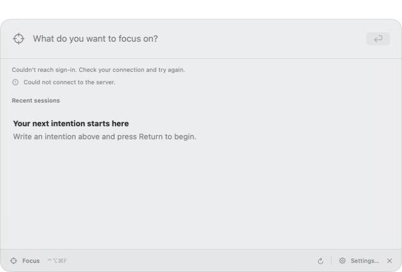
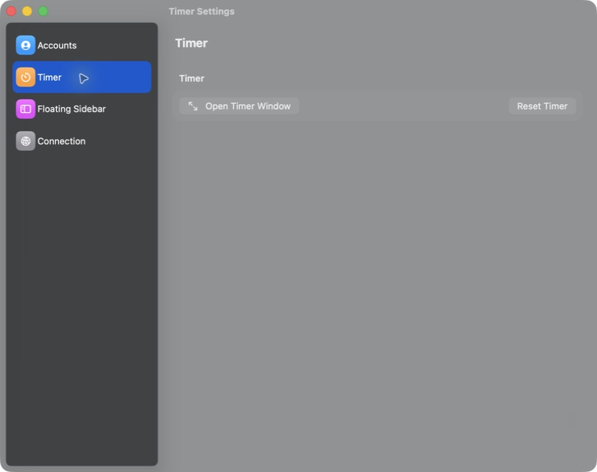

# macOS interface and architecture audit

Date: September 12, 2026. Status: audit and recommendations, with the step 2 ownership extraction now implemented and automatically verified in the working tree. See the completion evidence below. Recording activation is not implemented.

The current SwiftUI/AppKit foundation is appropriate. The next useful architectural investment is explicit ownership of application lifecycle, recording, and durable data. Keep the existing observable models and native presentation, and introduce boundaries as each feature needs them.

## Evidence and scope

Reviewed `apps/macos` composition, window management, Focus/authentication, stopwatch transport, settings, timing, contracts, and tests, alongside all five existing documents in `docs/design`. Source baseline: working tree at `c8f764d`, including the user's existing uncommitted planning work. Existing changes were preserved.

Inspected the running TimerMac app through screenshots and its accessibility tree. It was configured for the local API and showed connection failures. Its binary was not verified as identical to the checkout; source findings below are independently grounded in the files. No session was created, timer action issued, recording enabled, account changed, permission granted, or production write performed. Existing pending actions were left alone. The app was not quit or relaunched because that could lose pending work.

The current native test suite passed using `bun run --cwd apps/macos test`, including compilation. The first attempt was blocked by sandbox access to Xcode caches; the rerun with normal Xcode access reported `TEST SUCCEEDED`. Result bundle: `apps/macos/.derivedData/Logs/Test/Test-TimerMac-2026.09.12_16-09-18--0400.xcresult`. Toolchain: Swift 6.3.3; the project uses Swift 6 language mode, complete concurrency checking, and a macOS 14 deployment target. A newer compiler does not require raising the minimum OS.

This is partial live interface coverage, not authenticated end-to-end acceptance, a performance profile, or an accessibility certification. Session details, successful saves, real restart recovery, physical global-shortcut behavior, multiple displays, VoiceOver, and accessibility display settings remain unverified in this run.

## 1. Interface audit

The intended journey is: enter an intention, start deliberate work, see what is recording, pause/finish, then inspect evidence and a recap. The current interface supports parts of the session journey, but does not yet expose the planned recording-and-review loop.

### Step 1 — Open Focus: understandable entry, misleading failed-load state



**Strengths:** the intention is prominent; Refresh, Settings, and Close have named accessibility actions; the shortcut is discoverable. Source preserves typed intentions before authentication.

**Finding:** the screen shows connection errors while the main content says “Your next intention starts here” and invites Return. An unavailable session list looks like a successfully loaded empty history. Start is disabled in this screenshot, but the intention is also empty, so that alone does not establish an authentication bug. The problem is the contradictory presentation of load failure and onboarding.

**Owner:** [FocusWindowView.swift](../../apps/macos/TimerMac/Features/Focus/FocusWindowView.swift), lines 49–68; [FocusModel.swift](../../apps/macos/TimerMac/Features/Focus/FocusModel.swift), lines 69–99; [FocusPanelNotices.swift](../../apps/macos/TimerMac/Features/Focus/FocusPanelNotices.swift), lines 14–20.

**Recommended change:** represent initial loading, successfully empty, loaded, and failed-with/without-cached-content explicitly. Give failed loading a primary Retry action and retain cached history when available. Authentication status, history loading, and mutation delivery should be separate states. Do not infer “no sessions” from an initially empty array after a failed request.

**Accessibility risk:** small secondary text carries the recovery instructions. The screenshot suggests weak visual emphasis, but no contrast ratio or VoiceOver announcement behavior was measured. Make the recovery action prominent and verify reading order and keyboard focus on the actual recovery state.

### Step 2 — Navigate Settings and Accounts: functional, fragmented hierarchy



**Strengths:** categories are named and selectable in the accessibility tree. Accounts exposes Open Focus and account status; the Timer category exposes Open Timer Window and Reset Timer. Navigation between these categories worked.

**Finding:** Focus lives under Accounts, while Timer and Floating Sidebar refer to the other timer system. The Timer category repeats its heading and devotes a large window to two actions. This makes the product's conceptual organization harder to learn as it expands.

**Owners:** [SettingsDetailView.swift](../../apps/macos/TimerMac/Features/Settings/SettingsDetailView.swift), [SettingsView.swift](../../apps/macos/TimerMac/Features/Settings/SettingsView.swift), and [TimerSidebarController.swift](../../apps/macos/TimerMac/Features/FloatingTimer/TimerSidebarController.swift), lines 380–395.

**Recommended change:** give the session/review workspace a direct app-level entry. Keep account management in Accounts, appearance/placement in Settings, and routine work actions in the work surface. Later recording controls should have their own understandable permission/status entry. Decide whether the forced dark Settings appearance is intentional: source forces dark at both the SwiftUI and NSWindow layers while Focus follows appearance. This is a consistency decision, not a requirement to remove the existing visual style.

**Accessibility risk:** the captured gray/translucent surface makes secondary text visually subdued. Test active/inactive windows and Reduce Transparency before changing material values; a screenshot is insufficient to claim a numerical contrast failure.

### Step 3 — Open the separate Timer window: reachable, ambiguous terminology

Opening the Timer window from Settings worked. Its accessibility tree exposed Resume, Reset, offline state, and pending actions. It also called the readout “Focus elapsed.” Source confirms that this readout consumes `TimerModel`, not `FocusModel`.

**Owners:** [TimerReadoutView.swift](../../apps/macos/TimerMac/Features/Stopwatch/TimerReadoutView.swift), lines 5–14; [TimerMenuView.swift](../../apps/macos/TimerMac/App/TimerMenuView.swift); [TimerWindowView.swift](../../apps/macos/TimerMac/Features/Stopwatch/TimerWindowView.swift).

**Recommended change:** use distinct names while both systems coexist: “Shared stopwatch” and “Focus sessions,” or another equally explicit pair. A recording indicator must identify the recording session; the stopwatch running state cannot imply collection permission. Later, a deliberate product migration may make the floating widget control a Focus session, but that changes behavior and requires its own acceptance.

**Capture limit:** the Timer screenshot was clipped and rejected as visual evidence. This step's conclusions use the accessibility tree and source only. Floating-widget gestures and animation were reviewed in source/tests, not exercised visually here.

### Session detail and the future timeline: source review only

The unavailable API prevented inspecting a populated session detail in the running app. [FocusDetailView.swift](../../apps/macos/TimerMac/Features/Focus/FocusDetailView.swift) contains notes, recap editing, generated recap text, activity source/time, and evidence links. It preserves a useful distinction between edited and generated recap content. This is a sound starting point.

The planned evidence timeline needs more than the current event list: observed app activity, agent reports, user notes, inference, permission gaps, and delivery state need distinct representations. [FocusWorkEvent.swift](../../apps/macos/TimerMac/Features/Focus/FocusWorkEvent.swift) currently exposes source, kind, summary, occurrence time, and an optional evidence URL. Do not claim the present screen already meets the workflow-capture acceptance.

Keep the quick intention launcher compact. Add a roomier review destination when timeline navigation requires it, with the same selected session and repository underneath. Do not turn Settings or the floating widget into the main history browser.

## 2. Architecture findings by owner

### TimerSidebarController.swift — separate app ownership from widget ownership

**Priority: high before adding capture.** The 570-line controller creates Focus and auth models (lines 11–12), wires authentication (82–95), owns Settings/Timer/Focus windows (380–435), terminates the app (437), and manages detailed drag, collapse, geometry, haptics, and pointer monitoring. Window count and line count are not themselves defects; these unrelated lifetimes are the reason to split it.

Before: `TimerAppDelegate → TimerSidebarController → Focus/auth + all windows + widget behavior`.

After, proposed: `TimerAppDelegate → app composition + lifecycle`; a window coordinator owns app destinations; `TimerSidebarController` owns the floating panel and its interactions. Focus/auth services are constructed once and injected into the destinations that need them.

This makes a future Timeline window possible without importing widget geometry or constructing authentication. Keep AppKit for specialized panels and window behavior. Apple explicitly supports SwiftUI/AppKit interoperability, and `NSWindowController` is an available owner for window display, closing, and frame management. Adopting it is optional; the important change is the ownership boundary. [Apple interoperability guidance](https://developer.apple.com/videos/play/wwdc2026/272/), [NSWindowController](https://developer.apple.com/documentation/appkit/nswindowcontroller?language=objc).

### FocusModel.swift and TimerAppDelegate.swift — define durable work and termination policy

**Priority: high.** Focus stores sessions, drafts, and `pendingMutation` in memory; account reconfiguration clears them. Exact request bodies survive retries within the process, which is valuable, but they do not survive process termination. The menu quit action calls `terminate`; the app delegate has no `applicationShouldTerminate` check. The pending-save notice is not a quit guard, and ordinary draft edits have no corresponding quit protection.

Before: view action → `FocusModel` → HTTP → update memory.

After for the first local recording slice: recording command → local transaction → committed timeline → optional explicitly selected upload. Retain the current server-authoritative Focus path until its own repository migration is designed; local machine observations and current cloud Focus records can coexist with clear ownership.

Introduce a repository interface when implementing the first durable slice. Persist recording boundaries and observation events atomically, preserve stable event identity and provenance, and show local save separately from upload acknowledgement. SQLite is the leading storage candidate from the plans; choose its Swift access library through a small migration/restart spike. SwiftData can be evaluated against those same requirements, but should not be selected merely because the views use SwiftUI. No database dependency is selected here.

As an interim fix, a central termination policy should warn about unsaved Focus work. That improves ordinary Quit but cannot protect against crashes or forced termination. Sign-out, token expiry, recording stop, local locking, and local deletion must become distinct operations once the Mac holds canonical observations.

### TimerModel.swift — make service lifecycle explicit

**Priority: medium; combine with composition work.** Its initializer starts connection/ticker/workspace tasks (line 44); deinitialization cancels tasks and schedules transport shutdown (47–57). This makes constructing a model also start services. Existing clock and transport injection are useful seams.

Before: `TimerModel()` implicitly starts lifecycle work.

After, proposed: composition creates dependencies; app lifecycle explicitly starts/stops services; previews and tests can construct inert models. Keep `@MainActor` for UI state, and keep the existing transport actor isolated. Do not create a service per view redraw or cancel a recorder simply because a window closes.

The existing `@Observable`, `@Environment`, and `@Bindable` usage is a good fit. Apple describes observable models as the bridge between shared data and views; no migration to a different state framework is needed for this ownership change. [Managing model data](https://developer.apple.com/documentation/SwiftUI/Managing-model-data-in-your-app).

### FocusMutation.swift, FocusSession.swift, and native contract tests — share behavior evidence across languages

**Priority: medium before native offline replay.** Swift manually encodes requests and implements elapsed-time behavior; native tests contain their own fixtures. `packages/session-domain/testing` currently supplies shared fixtures to TypeScript server/browser tests, not Swift. Passing separately authored tests can still leave cross-language differences undetected.

Before: TypeScript fixtures and independently written Swift examples.

After, proposed: versioned language-neutral fixtures consumed by both suites, covering original timestamps, timer versus recap revision, duplicate commands, invalid transitions, and account changes. Typed `Encodable` request DTOs can replace `[String: Any]` as command work is touched. HTTP schema generation, domain-rule equivalence, and replication correctness are separate concerns; generating DTOs does not share business rules.

Keep the existing exact-request retry, generation checks after `await`, independent recap revisions, and monotonic timer projection. Do not introduce a Rust domain or replication core before the roadmap's ownership decision is resolved.

### Test and preview setup — cover the user states that model tests cannot show

**Priority: medium alongside each change.** Existing tests cover meaningful auth, retries, contracts, geometry, and projection behavior. `TimerAccessibilityTests` checks spoken time strings; it does not exercise VoiceOver navigation. No `#Preview` fixtures were found in the app source.

Add fixture-backed previews for initial loading, empty history, offline cached history, auth expiry, uncertain save, recap conflict, and the future permission-denied timeline. Add a small UI smoke path for opening/reopening windows and recovery focus. Add restart/migration tests when persistence exists. Keep geometry tests and manual display/drag checks as protection during controller extraction; do not rewrite that interaction code during an ownership move.

## 3. Plan audit

| Document | Useful direction to retain | Follow-up needed |
| --- | --- | --- |
| [August product/sync architecture](2026-08-29-focus-timer-product-and-sync-architecture.md), especially §26 | Current server authority, command/revision separation, recovery acceptance, existing work-log priority update | It still describes a browser/mobile-first durability sequence and later Mac observation. Link an explicit current-priority record so it cannot compete with the September 12 Mac-capture handoff. Preserve its historical implementation checkpoint. |
| [Agent workflow discovery](2026-09-08-agent-spend-and-workflow-discovery.md) | Tasks, runs, usage, outcomes, and user effort remain distinct; harness visibility requires proof | Separate passive observation from launching controlled agent work in the first capability matrix. Cost optimization and model comparisons are not prerequisites for the first useful timeline. |
| [Local-first architecture](2026-09-12-wellspent-local-first-architecture.md) | Immediate Mac capture, local detailed observations, selected structured backend writes; independent device writes as a future goal | Name the recording identity, local database owner, and pause/stop/restart policy before implementation. The existing Focus HTTP model cannot simply be relabeled local-first. |
| [Research roadmap](2026-09-12-wellspent-research-roadmap.md) | Immediate signal/permission/coverage matrix and one vertical slice; encrypted-sync research deferred | Add a short Mac implementation acceptance sheet separate from the much larger encrypted-sync register. Keep first-slice dependencies visible. |
| [Security design](2026-09-12-wellspent-security-design.md) | Local data, credentials, future vault authority, and intentional disclosure have separate owners | Apply collection/retention/disclosure rules to the capture slice now. Do not imply current E2EE or force future cryptographic research into the first recorder. This audit is not validation of the proposed protocol. |

The principal planning gap is the bridge from a cloud-backed session viewer to a locally durable recorder. The documents recognize most of the hard issues; they need one small executable milestone connecting them. This audit does not silently reorder or rewrite the existing plans.

## 4. Proposed structure and decision rules

Use feature-oriented folders in the existing Xcode target. Move files incrementally with their owning changes; folders need not become separate Swift packages.

| Area | Responsibility | Boundary |
| --- | --- | --- |
| `App/` | Composition, lifecycle, window routing, global commands | Constructs services once; owns when they start and stop |
| `Features/Stopwatch/` | Shared stopwatch controls and projection | Retains its current protocol and distinct identity |
| `Features/FloatingTimer/` | Panel, drag, shape, placement, motion | Presentation only; cannot authorize recording |
| `Features/Focus/` | Current cloud Focus list/detail, drafts, UI state | Calls its service/repository; does not collect OS activity |
| `Features/Settings/` | Settings categories, account settings, appearance and placement preferences | Configures existing capabilities; does not own their lifecycle |
| `Features/Recording/` — new when implemented | Explicit recording state, start/pause/stop policy, coverage | Owns collection authorization and restart behavior |
| `Features/Timeline/` — new when implemented | Durable evidence queries, source labels, gaps, review | Reads committed data; does not trigger uploads by rendering |
| `Services/` | Auth, HTTP/realtime adapters, OS collectors, persistence | Inject narrow capabilities; serialize mutations and keep blocking storage work off the UI executor |
| `Shared/` | Small genuinely shared value types and UI primitives | Avoid a generic utilities folder or a second app-wide store |

Folder organization implemented September 12, 2026: the 77 existing Swift source files now live under `App/`, the four implemented feature folders, and `Services/Auth/`, `Services/Focus/`, and `Services/Realtime/`. Source contents are unchanged. The existing filesystem-synchronized Xcode target and recursive lint script continue to own these files; entitlements remain at their existing path. Tests remain in `TimerMacTests/`. `Recording/`, `Timeline/`, and `Shared/` are deferred until they have concrete owners to contain.

Verification: SHA-256 checks confirmed identical contents for all 77 moved Swift files. Native compilation/tests (`bun run --cwd apps/macos test`) and lint passed; test result: `apps/macos/.derivedData/Logs/Test/Test-TimerMac-2026.09.12_17-32-40--0400.xcresult`. The initial sandboxed test attempt could not access Xcode/Swift caches; the rerun with cache access succeeded. Manual app interaction was not repeated for these file moves.

In Swift terms, a **view** describes what appears; an **observable feature model** supplies screen state and user actions; a **repository** owns durable records; a **service/actor** owns an external operation or isolated mutable resource; a **coordinator** owns a sequence or lifecycle crossing screens. `@Observable` makes data observable—it does not persist it. Actor isolation also does not by itself promise that blocking work runs on a background thread.

Use a small number of these boundaries where the code has actual responsibilities. A view does not automatically need its own model, and every concrete type does not need a protocol. Introduce protocols or closure interfaces where an external system, a deterministic test double, or a real future implementation must be substituted. The existing injected HTTP transport is a good example.

Three product decisions remain open before capture implementation:

1. **What starts recording?** Recommended: an explicit recording action with its own durable recording ID and an optional Focus-session association. Running the shared stopwatch alone does not authorize observation. This preserves session-independent work logging and permits a deliberate local recording when the Focus API is unavailable; it needs product agreement.
2. **What do pause, sleep, and restart mean?** Recommended starting policy: pause stops new machine collection; permission loss and sleep produce visible coverage gaps; restart restores committed history and shows recording as interrupted until explicitly resumed. Confirm the exact policy before implementing collectors. Delayed external agent events retain their original times and provenance rather than being discarded or relabeled as human focus.
3. **What is collected and retained?** Begin the feasibility matrix with app identity/transitions and lifecycle gaps. Window titles, document paths, screenshots, UI content, and richer agent text each need their own evidence and disclosure decision. The app's sandbox/network entitlements do not establish that a proposed collector works.

## 5. Recommended sequence

The [workflow-capture execution plan](2026-09-12-wellspent-workflow-capture-plan.md) owns the capture milestone. The steps below describe its macOS architecture preparation and supporting work; they are not a second independent backlog. Step 1 maps to execution-plan Task 1; step 2 is preparation for Task 2; step 3 is Task 2's synthetic durability proof; step 4 spans Tasks 2–3; step 5 spans Tasks 4–5.

1. **Record the first capture contract.** Produce the signal/permission/coverage matrix and resolve the three decisions above. Define one session's start → work → pause → finish → review states, including denied permission and offline behavior. No broad collection is implied.
2. **Extract composition and window ownership.** Move Focus/auth construction and auxiliary windows out of `TimerSidebarController`; make service startup explicit. Preserve widget geometry, singleton identities, window reuse, shortcuts, auth scope, retry behavior, and drafts. Run the native suite and a targeted window/drag smoke check. This is the first code change I recommend.
3. **Prove one durable local recording with synthetic events.** Commit recording state/events through a repository; reopen after termination; expose source, gaps, and save status in the timeline. Test interrupted writes/migration, duplicate event IDs, unavailable storage, scope switching, and rebuild equivalence. Choose the SQLite adapter here based on evidence.
4. **Connect one Mac signal and one harness adapter.** Use deliberately selected data and separately scoped permission/hook activation. Keep existing integration adapters and their delivery identities; newly collected detailed observations remain local. Verify pause/stop, denial/revocation, restart, delayed events, and no double counting.
5. **Add evidence-backed review.** Start with a readable timeline and manual recap. Then evaluate a recap built from explicitly selected evidence with citations and visible unknowns. Expand integrations or replication only when this loop is useful.

Keep TCA adoption, a Clean Architecture rewrite, package proliferation, custom crypto implementation, and wholesale timer unification outside this sequence. Reconsider them only when a concrete requirement or measured failure justifies the cost.

## 6. Models, readiness, and first coding task

You can start now. **Step 2 is the first coding task:** extract app composition and window ownership without changing timer behavior. It does not depend on choosing recording identity, signals, or storage. Step 1's source research can also begin now; its material product decisions must be settled before implementing the recorder. Starting either task does not imply that the later gates have passed.

These model/effort assignments are recommendations for Codex development sessions, not the model used inside Wellspent. They are engineering judgment, not measured results from a repository-specific model comparison. They align with the workflow-capture execution plan's existing defaults.

| Audit step | Recommended model | Reasoning | Why | Ready / dependency |
| --- | --- | --- | --- | --- |
| 1. Capture contract and signal discovery | GPT-6 Astra (`gpt-6-astra`) | High | Reconcile native capabilities, harness evidence, permission scope, and product semantics. | Research can start now. Resolve the recording decisions before collector implementation. |
| 2. App composition, windows, and explicit service lifecycle | GPT-5.6 Terra (`gpt-5.6-terra`) | High | Bounded Swift refactor with known owners and existing tests; lifecycle and shared-instance preservation need careful review. | Ready now. Preserve current behavior; this is the first coding task. |
| 3. Durable local recording with synthetic events | GPT-5.6 Terra | High | Implement the selected repository contract and verify atomicity, restart, migrations, and scope isolation. | Needs step 1's session/storage decisions and step 2's ownership boundary. Use Astra/High to resolve an unsettled storage or recovery design before coding it. |
| 4. One Mac collector and one harness adapter | GPT-5.6 Terra | High | Concrete adapter work with cancellation, correlation, retry, and privacy invariants. | Needs verified signals and the durable session contract. Escalate unexplained OS/harness behavior to Astra/High. |
| 5a. Inspectable timeline and manual review | GPT-5.6 Terra | Medium | UI implementation against established event and presentation contracts. | Start fixture-backed UI after the data contract is settled; real-use acceptance needs steps 3–4. Use High if identity/lifecycle logic expands. |
| 5b. Evidence-backed recap and real-use evaluation | GPT-6 Astra | High | Evaluate sparse or contradictory evidence, grounding, and whether the user can resume work accurately. | Needs an inspectable timeline and selected-input disclosure rules. Terra/High can implement a settled recap contract. |

The supporting audit fixes also have defaults; pick them up as separate small tasks rather than bundling them into the ownership extraction:

| Supporting task | Model / reasoning | Scope and acceptance |
| --- | --- | --- |
| Focus loading/error/empty-state recovery | Terra / High | Represent load outcomes explicitly; preserve drafts and pending saves. Verify failure, retry, cached content, and the native recovery UI. |
| Interim unsaved-work quit guard | Terra / High | Route ordinary app termination through one policy; verify cancel/quit and in-flight work. Do not claim crash durability. |
| Stopwatch terminology and Settings hierarchy | Terra / Medium | Terminology can be fixed now; settle navigation/appearance choices before redesign. Verify the visible result and keyboard access. |
| Shared Swift/TypeScript fixtures and typed request DTOs | Terra / High | Preserve payload identity, timestamps, revisions, and retry bytes; run the relevant suites in both languages. Do not add a second protocol. |
| Fixture-backed previews and focused UI smoke checks | Terra / Medium | Cover the named UI states with inert dependencies. Keep physical-device and VoiceOver evidence separate from compilation. |

Use **High** as the default for changes involving concurrency, authentication, retries, or persistence. Use **Medium** for settled presentation work. Move a bounded unresolved problem to **Astra/High** when a missing invariant or ownership decision is the obstacle; consider **Astra/XHigh** only if that specific problem remains difficult after the evidence is assembled. Max is not a default for these tasks. Keep one model through a coherent task when possible; record the actual model/effort only if known. If Terra is unavailable, Sol/High is a reasonable implementation fallback.

Official model documentation checked September 12, 2026: Astra supports complex reasoning/coding and High/XHigh; Terra is positioned to balance intelligence and cost and supports Medium/High; Sol supports High. These facts support the available choices, not a guarantee of task success or account availability. Sources: [Astra](https://developers.openai.com/api/docs/models/gpt-6-astra), [Terra](https://developers.openai.com/api/docs/models/gpt-5.6-terra), [Sol](https://developers.openai.com/api/docs/models/gpt-5.6-sol).

### Handoff: start the architecture work

Suggested session title: **macOS — app and window ownership**. Select **GPT-5.6 Terra / High**.

```text
Read AGENTS.md and docs/design/2026-09-12-macos-interface-and-architecture-audit.md. Implement audit step 2 only: separate app composition and auxiliary-window ownership from TimerSidebarController, and make service startup/shutdown explicit. Inspect current source and dirty changes first; use the applicable SwiftUI/concurrency skills. State the extraction plan and protect behavior before editing. Preserve one shared instance of each existing model/service, Focus account isolation and drafts, exact-request retry behavior, window reuse, shortcuts, and all floating-widget geometry/interaction. Keep dependencies unchanged. Do not implement recording, storage, timer unification, or a UI redesign. Run the native suite and the relevant window/drag smoke checks where available; do not quit a running app with pending user work to perform those checks. Report changed owners/files, passed/failed/unrun checks, and remaining risks. Update the audit with completion evidence. Recommended model: GPT-5.6 Terra, high reasoning; record actual model/effort only if known.
```

For capture research instead, use Task 1's existing handoff in the workflow-capture execution plan with **Astra/High**. The recording decisions remain open; no additional general architecture discussion is required before beginning the bounded ownership extraction.


## Step 2 implementation evidence — September 12, 2026

The first coding task is implemented on baseline `c8f764d` plus the scoped working-tree changes below. This completes the composition/window extraction; manual app lifecycle and physical interaction acceptance remain open. Step 1's recording decisions and all capture/storage work remain separate.

- **App composition:** new `apps/macos/TimerMac/App/TimerAppComposition.swift` constructs or receives one shared stopwatch model, Focus model, and Focus auth model, wires the existing account/authentication callbacks once, and owns service startup and shutdown. Its lazily created sidebar receives window/quit actions; it no longer constructs Focus or authentication.
- **Window ownership:** new `TimerWindowCoordinator.swift` owns Settings, Timer, and Focus windows, retaining each window and hosting view across close/reopen. Existing dimensions, styling, environment model identities, and Focus refresh behavior are retained. Menu, Settings, Focus, and Timer views route destination actions through this coordinator. The floating widget receives callbacks without owning those destinations.
- **Lifecycle:** `TimerAppDelegate.swift` starts composition after launch, routes workspace/activation/reopen events and the existing global shortcut, and awaits cleanup through `applicationShouldTerminate`. `TimerModel.swift` now constructs without connection, ticker, or workspace tasks; explicit `start()` is idempotent and `shutdown()` is terminal because its transport stream finishes. Shutdown cancels consumers and drains serialized operations before closing the transport. `FocusAuthModel.swift` stops auth tasks and rejects late refresh completion without removing saved credentials. Ordinary Quit still has no unsaved-work confirmation; this change does not add crash recovery or durable queues.
- **Preserved widget behavior:** `TimerSidebarController.swift` retains its floating panel, geometry, drag, collapse, pointer monitoring, placement, and haptic behavior. Only composition, auxiliary windows, and app actions moved. `TimerSidebarView.swift` routes its existing buttons through injected callbacks. No dependencies changed.
- **Regression coverage:** new `TimerAppCompositionTests.swift` covers inert construction, repeated startup, terminal shutdown, hosted window close/reopen and hosting-view reuse, widget-to-window routing, Focus draft retention, and auth-rejection wiring. `FocusAuthTests.swift` adds a held-refresh shutdown test that verifies credentials survive and can be restored by a new auth model.

Validation on macOS 26.3 (25D125), using fixture-backed/offline native tests:

| Check | Result / evidence |
| --- | --- |
| `bun run --cwd apps/macos test` | Passed, including the new composition/window tests and existing Focus account isolation, exact-request retry, AppKit drag/cursor, geometry, and Settings sidebar tests. Result: `apps/macos/.derivedData/Logs/Test/Test-TimerMac-2026.09.12_16-38-18--0400.xcresult`. |
| Focus auth suite after adding the late-refresh shutdown regression | Passed using the same Xcode scheme/configuration with `-only-testing:TimerMacTests/FocusAuthTests`. Result: `apps/macos/.derivedData/Logs/Test/Test-TimerMac-2026.09.12_16-39-14--0400.xcresult`. |
| `bun run --cwd apps/macos lint` and `git diff --check` | Passed. Formatting was limited to the changed Swift files. |
| Initial attempts | The sandboxed test run could not access Xcode caches. With normal Xcode access, compilation identified two Settings preparation callbacks still referencing the old controller; these were fixed before the successful runs. |
| Manual current-build drag, multiple displays, physical global shortcut, sleep/wake and ordinary Quit/relaunch | Not run. The existing user app was not quit or relaunched. Hosted window/drag checks do not establish these physical/lifecycle outcomes. |

The existing unrelated planning, capture, integration, and lockfile changes were preserved. No recorder, persistence adapter, UI redesign, timer unification, or production write was introduced. The findings earlier in this audit describe the pre-extraction baseline; this evidence supersedes their ownership/startup descriptions only.
