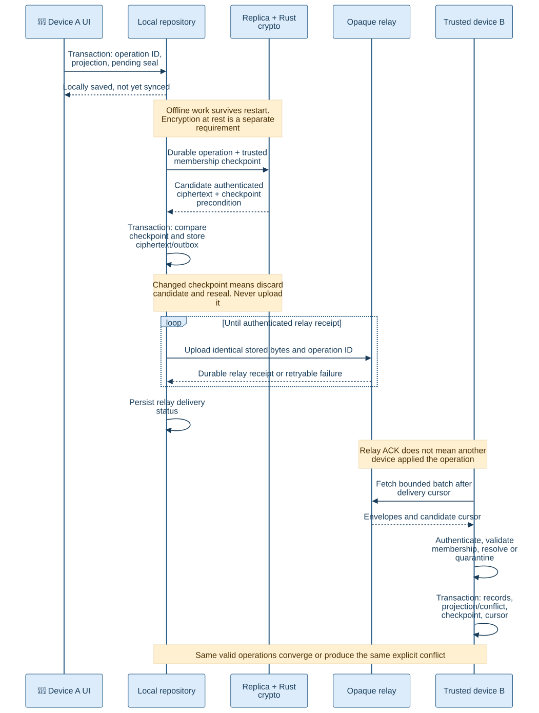

# Wellspent system design: a visual walkthrough

September 17, 2026 · Source baseline `4bd4cb6` plus the existing dirty worktree.

**Purpose:** make the system, its unresolved decisions and its implementation order reviewable. The [current plan](../WELLSPENT_PLAN.md) owns priorities and status; this document explains architecture and experiment dependencies. [Browse the diagrams](2026-09-17-wellspent-system-design.html) or use the numbered views below. The [documentation index](README.md) maps the other architecture and evidence documents.

**Recommendation:** frontload a bounded portable Rust experiment alongside the CLI-to-PR evidence experiment. Spend the compute window on membership/recovery rules, durable retry behavior, cross-language boundaries and evidence attribution. Do not mistake encryption round trips for a complete sync protocol, or a useful memory demo for reliable measurement.

## 1. The product we are building

Help a person understand how they work with agents: what task they pursued, where they switched context, which model/effort they used, what usage was observed, what the PR review found, and what required rework. Present findings with inspectable evidence and uncertainty. There is no single productivity score. The first memory experiment shows findings to the user; feeding lessons into agents is a later phase.

Confirmed direction from this conversation:

- Observe ordinary **Codex terminal** work first. A Wellspent-managed agent launcher is not a prerequisite.
- Capture both application changes and task/project changes; they are different signals.
- GitHub is the next desired external integration. OpenAI account integration is a candidate only if it adds evidence beyond local Codex telemetry.
- Start Mac-first, while preserving independently writable trusted phones as the target. The phone does not need an awake Mac to save a task.
- Private-record sync is E2EE: Wellspent's relay must not receive decryption keys.
- Default hosted disclosure goes from the device to the selected provider. Optional premium processing can receive explicitly selected plaintext through Wellspent's backend. Payment does not authorize disclosure.
- Local and hosted AI/memory are both of interest. Required offline inference quality/hardware and the exact first phone/web experience are still open.

Throughout this document, **current** means inspected source exists, not a fresh production or signed-build acceptance. **Target** means intended behavior; **candidate** means a recommendation awaiting a decision or experiment. All seven diagrams were parsed and rendered; diagrams 2–7 describe proposed structures or flows.

## 2. What exists today

[Editable Mermaid source](diagrams/2026-09-17-wellspent_01_current.mmd)

These are three separate authorities, even when their controls appear in the same app:

| Current lane | Owner and durability | Important boundary / source |
| --- | --- | --- |
| Local recording | Native Mac is the sole SQLite writer; recording events, interval boundaries and original metadata survive restart. | [Recording model](../../apps/macos/TimerMac/Features/Recording/RecordingModel.swift), [SQLite repository](../../apps/macos/TimerMac/Services/Recording/SQLiteRecordingRepository.swift). No encrypted DB or E2EE replication is implemented here. |
| Local agent intake | Node helpers durably spool; Mac pulls over authenticated loopback and ACKs after commit. | [Metadata helper](../../integrations/codex/local-helper.mjs), [MCP notes](../../integrations/codex/harness-mcp.mjs), [development supervisor](../../integrations/codex/harness-dev.mjs). Automatic hooks and explicit notes have separate admission rules. |
| Authenticated Focus / work log | Nest/Postgres owns plaintext records, command identity, timer revision and separate recap revision. | [Focus repository](../../apps/api/src/focus/focus.repository.ts), [cloud work-log guide](../work-log.md). Web and Mac have Focus clients; mobile is still on the stopwatch lane. |
| Browser recovery | Account-scoped localStorage commands and snapshots; HTTP replay; optional live hints. | [Focus outbox](../../apps/web/app/focus/focus-outbox.ts). IndexedDB and cursor-based replication remain targets. Mac Focus pending mutations/drafts are memory-only. |
| Shared stopwatch | One persisted Postgres row, committed before process-local WebSocket broadcast. | [Realtime repository](../../apps/api/src/realtime/realtime-timer.repository.ts). Not account-isolated personal history; client pending commands and APNs registrations are not durable. |
| Existing integrations | Google OAuth credentials are server-decryptable; selected completed Focus exports go to Sheets/Calendar. | [Integration behavior](../google-integrations.md). Selected Calendar publication exists; personal-calendar planning and inbound interpretation are different work. |
| Existing AI | Web chat → Nest → AI Gateway/provider. | [Assistant service](../../apps/api/src/assistant/assistant.service.ts). Plaintext server processing; not the proposed premium consent-controlled service or capture recap. |

The [timer-recording controller](../../apps/macos/TimerMac/Features/Stopwatch/TimerRecordingController.swift) couples local Start/Pause intent to capture. Remote timer state does not authorize recording. Reset preserves recording history; recording Finish is separate. Current recording storage permits one unfinished recording, whereas Focus permits multiple sessions. Neither background-agent overlap nor summed app durations establishes focused human time.

Current Mac signing, helper installation and lifecycle acceptance must retain their existing evidence limits. `b dev` supervising a helper is a development path, not a packaged background-service installer. Repository Vercel queue/cron configuration is also not proof of the live deployment or WebSocket topology.

## 3. Target system and trust boundaries

[Editable Mermaid source](diagrams/2026-09-17-wellspent_02_target.mmd)

The proposed target has four distinct responsibilities:

1. **Evidence and interpretation on the device.** Collectors record authorized observations. Explicit or inferred links connect work to tasks and PRs. Corrections preserve originals. Deterministic views remain available without AI.
2. **Private replicated records.** Each trusted device commits its own operations. A shared protocol validates membership and encrypted records. The relay stores opaque data and delivery metadata; it cannot validate plaintext domain semantics.
3. **Optional reasoning and memory.** A local policy component selects what may leave the device. Providers produce derived findings, saved separately from source observations. Memory is replaceable and cannot grant permissions.
4. **Account and explicitly delegated services.** Authentication, quota and premium entitlement remain service concerns. Account login is not permission to enroll a decryption device. Premium processing and provider credentials are separate from the ciphertext relay.

These are logical boundaries, not a recommendation to create four independently deployed services now. Start with the smallest deployment that enforces their access rules. Future relay hosting, key-management services and background-worker placement remain decisions.

| Data class | Proposed authority / storage | Disclosure rule |
| --- | --- | --- |
| Raw CLI/app observations | Local evidence repository; which subset replicates is R01 | Richer content requires collection opt-in. No automatic model/memory export. |
| Tasks, notes, corrections, source associations | Candidate first private replicated dataset | Encrypted at the device. A source reference alone does not make its underlying evidence available on another device. |
| GitHub snapshots and review findings | GitHub owns upstream facts; Wellspent owns a versioned local observation | Candidate first adapter reads on the device. Server webhooks that expose private repository data would be a separate disclosure decision. |
| Model/usage observations | Source-reported facts with scope, timestamp and coverage | Preserve provider-native fields and unknowns. Estimated cost, actual bill and subscription quota remain distinct. |
| Derived memory/findings | Local versioned results plus optional provider copies | Record source references, provider, input selection and correction status. Provider retention/deletion must be specified. |
| Account, billing and relay routing metadata | Wellspent service | Necessary metadata may be visible even with E2EE; user labels/content need not be cleartext routing fields. |
| Premium job input | Selected plaintext disclosed for a named operation | No vault keys or implicit whole-history access. Background availability depends on prior delegation and payload availability. |

## 4. Evidence model: connect the work before scoring it

[Editable Mermaid source](diagrams/2026-09-17-wellspent_03_evidence.mmd)

The task is a useful organizing concept, not an identity guessed from an app name. One task may span recordings, agent threads and PRs; a single PR or agent thread may contain several tasks. Model these associations explicitly with provenance rather than requiring a one-to-one hierarchy.

Necessary rules to prove:

- **Identity:** repository/worktree/branch/thread/turn/request/PR identifiers have distinct scopes. Branch names change; rebases and squash merges break naive commit matching. Unlinked evidence remains visible instead of being silently assigned by time overlap.
- **Time:** preserve source occurrence, hook receipt and local receipt separately. Monotonic interval time measures one process's elapsed coverage; a wall clock cannot prove agent execution duration or human attention.
- **Usage:** distinguish request deltas from cumulative session counters. Resume, compaction, model switches and nested agents must not double-count. Unknown usage is not zero. An output total may already include reasoning tokens; normalize only when the source defines that relationship.
- **Corrections:** changing a task association or disputing a finding creates a new interpretation. Original observations remain available. Derived findings become stale or are regenerated with their prior versions preserved according to retention policy.
- **Outcomes:** approval, merge, passing CI, bug reports and review comments are separate observations. A merged PR is not proof of defect-free work, and more comments do not necessarily mean worse work. The definition of accepted PR remains open.

The current [recording event](../../apps/macos/TimerMac/Features/Recording/RecordingEvent.swift) and [local metadata contract](../../integrations/codex/local-contract.mjs) do not contain the proposed task graph or model/effort/token accounting. The [snapshot reducer](../../apps/macos/TimerMac/Features/Recording/RecordingSnapshot.swift) currently admits ordinary notes only in an active interval. Post-session corrections therefore need their own semantics; weakening capture admission would be the wrong implementation shortcut.

## 5. Where portable Rust belongs

[Editable Mermaid source](diagrams/2026-09-17-wellspent_04_rust.mmd)

**Frontload this, with a narrow scope.** The existing Rust code is only the [Tauri shell](../../apps/desktop/src-tauri/Cargo.toml), not a portable crypto implementation. A new experimental library should be independently testable and should not require migrating native UI or current recording storage.

| Component | Working recommendation | Explicitly outside that component |
| --- | --- | --- |
| Rust vault protocol core | Versioned encoding, authenticated record/envelope operations, membership validation, explicit transition results and error types | UI, foreground collection, GitHub semantics, consent decisions, automatic network/DB writes |
| Cryptographic dependencies | Investigate HPKE for epoch-key envelopes and a mature AEAD for records; pin minimal features after review | Writing new cryptographic primitives or assuming library support proves a complete protocol secure |
| Replica/domain engine | Choose Rust-owned transitions or conformance-tested platform implementations using the same fixtures | Treating a relay cursor, timestamp or signature as a complete conflict-resolution policy |
| Native facades | Swift on Mac; Swift/Kotlin Expo modules; coarse calls and opaque handles | Long-lived vault/device keys in JavaScript; one bridge call per tiny field |
| Platform persistence | Transactional operations, projections, outbox, checkpoints; native key-storage integration | Making cryptography perform hidden commits or inventing a second uncoordinated SQLite writer |

A pure result from the core still needs a durable commit. Repository adapters must compare the checkpoint used to compute it before applying it. Do not advance key epochs, replay state or delivery cursors only in memory and then report success.

R07 is a real decision: sharing crypto alone does not share causal ordering, membership adoption or replay logic. Test a small shared transition reducer before deciding whether Rust also owns the replica engine. Keep existing Focus TypeScript rules and native recording rules as separate domains until an explicit migration/conformance contract replaces them.

Primary-source findings, checked September 17:

- [RFC 9180](https://www.rfc-editor.org/rfc/rfc9180.html#section-9.7) specifies HPKE, not Wellspent membership, replay or recovery. Those rules need their own specification.
- [rust-hpke](https://github.com/rozbb/rust-hpke) is a candidate implementation, not an audited Wellspent construction. Inspect the selected version/features and audit scope before pinning it.
- [RustCrypto ChaCha20Poly1305](https://docs.rs/chacha20poly1305/latest/chacha20poly1305/) documents XChaCha20Poly1305 and an implementation audit; that does not audit our protocol or every dependency/version.
- [UniFFI](https://mozilla.github.io/uniffi-rs/latest/) supports Swift/Kotlin bindings, while distributing compiled libraries remains application work. Its [Swift guide](https://mozilla.github.io/uniffi-rs/latest/swift/overview.html) describes partial Swift 6 support; [Kotlin packaging](https://mozilla.github.io/uniffi-rs/latest/kotlin/gradle.html) has its own dependencies. Test the actual wrappers before freezing an interface.
- [Expo Modules](https://docs.expo.dev/modules/overview/) provides the platform wrapper mechanism. Software-key portability and non-exportable hardware-key integration are separate experiments.

No crate, suite, FFI version, wire format or local-database encryption library is selected by this document. Rust is the frontloaded implementation candidate; this pass delivered design and diagrams, not crypto code.

### Distribution target and helper feasibility

The user selected **Mac App Store plus signed direct download** as the target, with app stores preferred across supported platforms where feasible. Share the protocol core and native application behavior; keep channel-specific signing, installation and updates explicit. Simultaneous releases and complete feature parity are not yet commitments.

Apple's [Mac App Store requirements](https://developer.apple.com/app-store/review/guidelines/#hardware-compatibility) require appropriate sandboxing and a self-contained application bundle, restrict installers and privilege escalation, and require consent for specified background/startup behavior. Store updates must use the store. These constraints make helper distribution an early feasibility question, not a final packaging chore.

The [current Mac entitlements](../../apps/macos/TimerMac/TimerMac.entitlements) enable App Sandbox and outbound network access. The [development harness runner](../../integrations/codex/harness-dev.mjs) runs outside that app sandbox; its success does not prove a store-compatible installation or capture path. A compiled Rust helper could remove a separately installed Node runtime requirement, but does not grant filesystem access, bypass sandbox restrictions or establish App Review acceptance.

Extend the early Gate 3 experiment with a non-sensitive Rust operation inside the sandboxed Swift app and a synthetic CLI event handoff through the proposed helper boundary. Record permitted storage, authentication, process ownership, consent, launch/quit behavior and how an ordinary terminal Codex workflow connects without requiring an external installer. Test signed lifecycle separately for each distribution channel. If a required capability cannot fit the store path, document the exact gap before choosing different capabilities or release timing. Preserve current development hooks and recording storage during this experiment.

## 6. Durable encrypted delivery

[Editable Mermaid source](diagrams/2026-09-17-wellspent_05_replication.mmd)

This candidate uses two durable steps: save the local operation/projection and pending work, then atomically store its encrypted outbox bytes against the expected membership checkpoint. A crash between them leaves durable work to seal. No candidate ciphertext is uploaded before its outbox commit. An alternative single-transaction preparation design may be selected if it preserves the same guarantees.

Three user-visible states must remain distinct: **saved on this device**, **stored by the relay**, and **applied on another device**. An authenticated relay ACK establishes the specified delivery contract under an honest relay; a malicious relay can still lie, omit or delete data. Backups and peer evidence are separate protections.

| Failure experiment | Required observation |
| --- | --- |
| Kill before/after local commit, sealing, upload or ACK persistence | Committed originals remain; restart rebuilds the same projection; retry reuses stored ciphertext and identity. |
| Duplicate or reordered valid operations | Deterministic convergence or the same explicit conflict; never duplicate usage or overwrite an original silently. |
| Same ID with different authenticated body | Preserve original and expose conflict/quarantine, not a last-writer replacement. |
| Changed membership while preparing ciphertext | Reject stale preparation and reseal/reissue under the defined rule before publication. |
| Remove B while A is offline | Fresh epochs protect writes after adoption. Old data remains readable with old keys; stale legitimate pending work is preserved. |
| Relay rollback/fork or concurrent membership edits | Reject known rollback; expose incompatible signed histories. Do not claim an unseen newer history can always be detected. |
| Recovery after rotations with lost devices | Recover only surviving ciphertext covered by authorized material. Missing history and stale checkpoints remain visible. |
| Edit versus deletion / long-offline peer | Defined tombstone and retention policy prevents silent resurrection; local originals are preserved until the migration/deletion contract permits removal. |
| Invalid download among valid items | Bounded validation and explicit quarantine policy; checkpoint/cursor advancement commits with durable handling, not merely fetch. |

Account login, vault enrollment, capture pairing, local unlock and AI disclosure grants are different authorities. Sign-out, stop recording, lock, revoke device, delete record and delete account need separate transitions. Do not inherit an older logout-and-wipe policy into a local-canonical vault.

## 7. AI, memory and premium processing

[Editable Mermaid source](diagrams/2026-09-17-wellspent_06_disclosure.mmd)

Wellspent owns the original evidence and permissions. A memory service may derive useful representations from selected inputs, but the app must remain usable if that service is disconnected or replaced. The first experiment compares simple local retrieval with an optional memory adapter and presents findings only to the user.

Honcho is a candidate, not a dependency decision. Its [Codex integration](https://github.com/plastic-labs/codex-honcho) documents automatic conversation capture and background upload. [Hermes memory providers](https://hermes-agent.nousresearch.com/docs/user-guide/features/memory-providers) can synchronize turns and inject context. Those behaviors must not bypass Wellspent's selection policy or enable the deferred agent-feedback phase. [Honcho's local stack](https://github.com/plastic-labs/honcho) also uses configured model services; self-hosting storage alone does not establish offline reasoning.

The minimum disclosure record should identify selected immutable input versions, recipient/route, purpose, permitted scope, authorization, request/job identity, output references and actual outcome. Expiry/revocation controls future calls; it cannot retract earlier disclosures. Failure and retry must not silently broaden the input or send it to a different provider.

Open design points include direct-provider credential ownership, premium retention, memory deletion/rebuild, local inference hardware, and cloud jobs while every trusted device is offline. No always-online agent or managed runtime is necessary for the first user-facing findings experiment. Existing server chat is not automatically promoted into the premium service.

## 8. Build order and the compute window

[Editable Mermaid source](diagrams/2026-09-17-wellspent_07_order.mmd)

These are dependencies under the existing [research gates](2026-09-12-wellspent-research-roadmap.md#outcome-sized-research-sequence), not a second status queue. The [current plan](../WELLSPENT_PLAN.md) records which slice is active.

| Order | Deliverable | Acceptance / decision unlocked |
| --- | --- | --- |
| 1. Record and trust contracts | Small candidate dataset; membership/revocation/recovery choices; explicit A/B/C failure examples | R01–R07 decisions or named competing hypotheses. No convenient default is silently treated as a user decision. |
| 2A. Protocol model | Executable legal/illegal transition fixtures, independent of network/provider code | Gate 1: pairing, removal, recovery, rollback/fork, stale writer, concurrent edits have defined outcomes. |
| 2B. Portable binding smoke | One versioned synthetic payload and structured error through Rust → Swift macOS and Swift/Kotlin mobile wrappers | Early Gate 3: packaging, errors, lifetime, concurrency/cancellation. This can start with a dummy core while trust decisions remain open. |
| 2C. CLI-to-PR fixture | One task across two Codex sessions, project switches and a review; model changes, cumulative usage, missing fields | Validate identity/provenance and no double-counting. Then select one ordinary real workflow with declared capture scope. |
| 3A. Rust durable proof | CLI, disposable local repository and directory relay; approved membership scenario | Gate 2: encryption/authentication failures, exact retry, kill/restart, rotation/recovery and convergent or explicitly conflicting projections. |
| 3B. Findings/disclosure proof | Corrected review finding, unrelated private canary, later similar task; fake provider before selected real provider | Source-grounded user findings; correction propagation, no out-of-scope inputs, offline review, deletion/export/rebuild behavior and usage/latency evidence. |
| 4. Native acceptance | Chosen Rust boundary with actual repositories, storage keys and signed/native lifecycle | Gate 3 completion: physical platforms separately; lock/reboot/reinstall/restore; packaged helper; do not count compilation as device acceptance. |
| 5. Relay and migration | Opaque service + catch-up limits + synthetic legacy import/reconciliation | Gate 4: interrupted import, old clients, queued commands, backup/restore, retained originals. No indefinite plaintext dual-write. |
| Later | External protocol review, release operations, additional adapters, agent feedback | Release evidence and product value determine expansion. Calendar/Linear automation, custom agent runtime and hardware-key HPKE are not prerequisites. |

**Before September 19 at 04:40:** prioritize contracts, adversarial fixtures, the binding smoke and evidence identity design. **After reset through September 20 at 22:00:** prioritize the Rust durable/fault experiments and evidence/findings proof; reserve time to review failures and record final decisions. These are user-reported times, with Eastern assumed. The 41-hour-20-minute second window is wall-clock availability, not an engineering estimate. No promise that every gate fits this window; provider budget, hands-on availability and physical devices are still unspecified.

High-compute work is reasoning about adversarial state transitions, fault injection, cross-language contracts and ambiguous evidence. Routine rendering, UI polish and repeating previously accepted capture tests should not consume that priority. FFI and evidence work can proceed independently while protocol choices are resolved; unresolved recovery authority should not be buried inside a crypto implementation.

### First Rust handoff

Read the security design and R01–R09. Write explicit A/B/C state-machine fixtures and a minimal native-facing operation/error contract. Separate agreed requirements from hypothesis variants. Prove a non-sensitive Rust binding through Mac Swift and mobile wrappers without changing existing recording storage. Then implement the selected synthetic protocol scenario in a standalone crate with a directory relay and disposable persistence, pinning reviewed minimal dependencies. Exercise commit/ACK crash points, immutable ciphertext retries and rotation/recovery before UI integration. Retain current queues, databases, hooks and credentials. Report each platform as built, executed, failed or unrun; do not claim production E2EE acceptance.

## 9. Decisions to walk through together

| Decision | Recommended starting hypothesis | What remains the user's choice |
| --- | --- | --- |
| First replicated data | Tasks, notes, corrections, associations and selected evidence; detailed raw capture Mac-local by default | Which records must be readable/editable on phone and whether raw evidence must follow citations |
| Device admission | Existing trusted device approval; account login alone cannot enroll | Any trusted device versus designated authority; behavior after concurrent membership changes |
| Revocation | Local writes continue; new epoch adopted before subsequent publication under that known state | Whether stronger publication freshness justifies restrictions; unavailable peers cannot promise instant revocation |
| Recovery | User-held high-entropy recovery material plus encrypted export | UX burden, enrollment authority, whether recovery removes old devices; acceptable permanent-loss scenario |
| Web participation | Preserve current web; native encrypted peers first | Full decrypting offline web, device-mediated view, or account/delegation-only web |
| Rust scope | Share security protocol; compare a shared replica reducer before freezing FFI | Tradeoff between shared Rust domain logic and separately conforming Swift/TypeScript implementations |
| Activity boundaries | Retain current explicit recording authorization; task links span sessions | Whether future background cloud-agent runs are independently opt-in outside timer intervals |
| GitHub evidence | Device-side read adapter, versioned review/commit snapshots, correctable task links | Approval versus merge as accepted; multiple repos/accounts; whether raw diffs/reviews may enter memory |
| Provider and offline AI | Useful local deterministic review; replaceable optional model/memory adapter | Authentication mode, direct-provider payment/keys, required offline inference quality, premium retention |

A local-first product cannot obtain cloud-agent events while a device is offline without an external collector or later provider catch-up. That collector's plaintext access, credentials and retention are separate design choices; a running clock or MCP connection does not establish complete agent coverage.

## 10. Migration, operations and documentation reconciliation

The old server-canonical Focus architecture and the new E2EE target coexist during development. Before any production migration, inventory server sessions, work logs, browser pending commands, native local recordings, provider jobs and backups. Preserve IDs, original times and unacknowledged commands; import into a new local scope; verify counts and projections; then define the plaintext-write cutoff and old-client behavior. Re-encryption cannot erase previous plaintext disclosures or server/provider backups.

Retain content-free diagnostics for capture gaps, rejected associations, queue age, relay receipt state, conflict/quarantine counts, rebuild failures, schema versions and provider availability. Test rate/payload bounds, corrupt records, interrupted migrations, long-offline peers and backup restore. E2EE does not guarantee relay availability or hide all timing/size metadata.

Historical documents remain useful, with these corrections:

- The August document's “locked” plaintext/server-authoritative, full-web and client-framework choices are historical defaults. They do not decide the new vault architecture.
- Earlier capture documents deferred crypto to prove local value. September 17 now selects encrypted architecture and a portable Rust experiment for early attention; old acceptance evidence is unchanged.
- macOS has authenticated Focus access, but still lacks its durable native offline repository. Do not group it with the mobile placeholder when describing feature availability.
- Native OpenAPI shares an HTTP contract, not reducers or a replication algorithm. Tauri Rust, SQLiteData storage and native auth Keychain each solve different problems from vault crypto.
- Current Google integration and backend AI are server-readable features. Their future coexistence, migration or removal must be explicit rather than hidden behind a general privacy claim.

## 11. Verification of this documentation pass

- Inspected current source owners, manifests and the architecture/evidence documents listed in the index; used two bounded read-only reviews for current-system coverage and Rust feasibility. No private recordings, transcripts, credentials or live provider accounts were inspected.
- Rendered all seven Mermaid sources with Mermaid CLI **11.17.0**, using an isolated headless Chrome process. Parser validation caught and corrected sequence-label separators before inclusion. Exported SVGs and a local walkthrough; no runtime dependencies were added to the repository.
- The invoked skill's supplementary guides/scripts were absent from its installed folder, so its manual `.mmd` → `mmdc` → rendered-image workflow was used.
- Checked new local document/asset links, source/render correspondence and patch whitespace. See the diagram directory's [rendering notes](diagrams/README.md) for reproduction.
- Loaded all seven embedded diagrams in the HTML walkthrough with external page requests blocked; exercised actual-size/fit controls on four views with no browser errors.
- These checks establish documentation consistency and renderability. They do not establish crypto security, source-code correctness, native build/device behavior, provider integration or deployment. No product implementation, migrations, hooks or account configuration changed.
